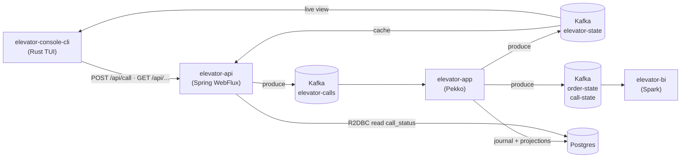
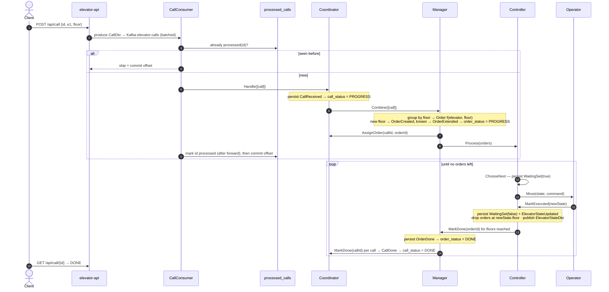
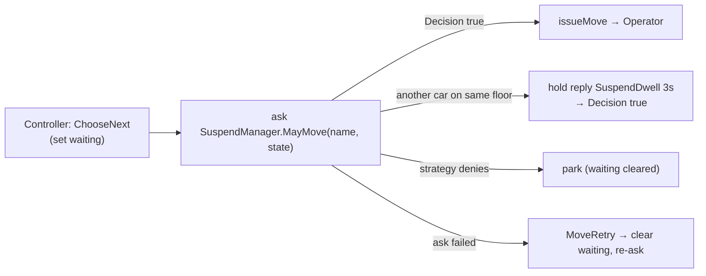
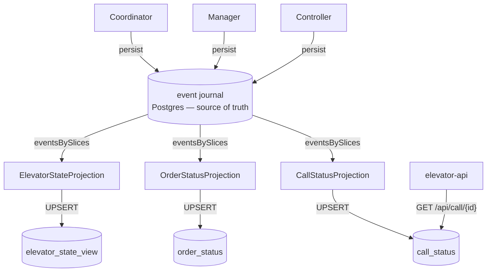

# Architecture & Actor Contract

How the system fits together, and the exact contract each actor speaks. Usage / run / CI-CD is in
**[README.md](README.md)**. If a doc and the code disagree, **trust the code** and fix this file.
Diagrams are [Mermaid](https://mermaid.js.org).

## Words (Call vs Order)

| Term | Meaning |
|---|---|
| **Call** | A user action — a button press. `id, elevatorName, floor`, optional `passengerId`. |
| **Order** | App-made. One living stop per floor. `id = f(elevator, floor)`; later same-floor calls attach until it is done. Counts `passengers` (distinct riders) vs. `anonymous` (id-less presses). |
| **Coordinator** | Actor, owns **call** status. Receives calls, forwards them, tracks each to done. |
| **Manager** | Actor, owns the **call ↔ order** relation. Groups calls into orders, assigns, marks done. |
| **Controller** | Actor, owns **movement**. Picks the next stop, tells the Operator to move. |
| **Operator** | Actor, **stateless**. Applies one move on the engine. |

---

## Modules

| Module | Stack | Role |
|---|---|---|
| `elevator-common` | Scala 3 | Shared library, split into small submodules (below). |
| `elevator-app` | Pekko | The brain: event-sourced actors + R2DBC journal + read-side projections. |
| `elevator-api` | Spring WebFlux | HTTP edge: REST + SSE, Kafka producer/consumer, R2DBC reads, health. No actors. |
| `elevator-console-cli` | Rust (ratatui) | Terminal dashboard + call sender. |
| `elevator-console-web` | Elm | Read-only browser monitor. |
| `elevator-bi` | Scala 2.12 / Spark | **Standalone** batch job → Parquet (read by the api via DuckDB). |

`elevator-common` keeps a clean layering; app actors are **thin shells** wiring the pure logic:

```
core (pure domain + engine) → events → logic (decide/evolve, Pekko-free)
  → protocol (message ADTs) → strategy (NextFloor, GroupCalls) → dto, serializable
```

Both consoles are pure HTTP clients of `elevator-api` — **neither touches Kafka**.

## Data flow



### Kafka topics

| Topic | Producer | Consumer | Payload |
|---|---|---|---|
| `elevator-calls` | api | app (`CallConsumer`) | `CallDto{id, elevatorName, floor, passengerId?}` |
| `elevator-state` | app | api cache, console, BI | `ElevatorStateDto{elevatorName, direction, motion, floor}` |
| `elevator-order-state` | app | BI | `OrderStateDto{orderId, elevatorName, floor, status, callIds, passengers, anonymous}` |
| `elevator-call-state` | app | BI | `CallStateDto{id, elevatorName, floor, status}` |

All keyed by `elevatorName`.

---

## The four actors

One elevator = **four actors**. Three **remember** (event-sourced — state is the fold of their
events); the **Operator** is a dumb, stateless worker.

| Actor | State | Owns |
|---|---|---|
| **Coordinator** | `Map[CallId, Floor]` | call status |
| **Manager** | `Map[OrderId, Order]` | call ↔ order |
| **Controller** | `waiting · ElevatorState · Set[Order]` | direction (movement) |
| **Operator** | — (stateless) | one move |

`[cmd]` in · `[evt]` stored to the journal · `[pub]` published to Kafka.

**Coordinator**
- `[cmd] Handle(List[Call])` → `[evt] CallReceived` · `[pub]` call = PROGRESS · → `Manager.Combine`
- `[cmd] AssignOrder(CallId, OrderId)` → `[evt] CallAssigned`
- `[cmd] MarkDone(CallId)` → `[evt] CallDone` · `[pub]` call = DONE

**Manager**
- `[cmd] Combine(List[Call])` → `[evt] OrderCreated | OrderExtended` · `[pub]` order = PROGRESS · → `Coordinator.AssignOrder`, `Controller.Process`
- `[cmd] MarkDone(OrderId)` → `[evt] OrderDone` · `[pub]` order = DONE · → `Coordinator.MarkDone`

**Controller**
- `[cmd] Process(Set[Order])` → `[evt] OrderAccepted` · → self `ChooseNext`
- `[cmd] ChooseNext(Set[Order])` → `[evt] WaitingSet(true)` · → `Operator.Move`
- `[cmd] MarkExecuted(ElevatorState)` → `[evt] WaitingSet(false), ElevatorStateUpdated` · `[pub]` elevator · → `Manager.MarkDone` (floor reached)

**Operator** (stateless)
- `[cmd] Move(ElevatorName, ElevatorState, Command)` → no event · → `Controller.MarkExecuted`

Two things to hold onto:

- The **Controller drives its own loop** — after each move it self-sends `ChooseNext`. The engine
  paces it (real travel time), not a timer.
- Serving is **floor-based** — reaching a floor closes *every* order waiting there at once, which
  closes every call under them.

## One call, end to end



`served = orders where floor == newState.floor` — reaching a floor serves every order there at once.

### Why the loop is messages, not a blocking call

`ChooseNext` + `WaitingSet` turn the move loop into persisted messages, so a crash mid-move
re-issues the move on recovery. A blocking loop cannot. Actors also speak only domain types —
`CallConsumer` maps `CallDto → Call` at the edge, so no DTOs leak inside.

---

## Scheduling (SCAN)

The Controller picks the next move with a pure function, `NextFloorStrategy.default` — a simple
**SCAN**: keep going the same way while a target is ahead, else reverse, else stop.

```scala
if targets.contains(current) then Stop()               // arrived → stop, serve floor
else if targetAhead(current, dir, targets) then Go(dir)
else if targets.nonEmpty then Go(dir.swap)             // turn around
else Stop()                                            // nothing to do
```

Its sibling `GroupCallsStrategy` groups same-floor calls into orders (`order id = f(elevator,
floor)`, so later same-floor calls attach to the same order). Source:
`elevator-common-strategy/.../{NextFloor,GroupCalls}Strategy.scala`.

## The move gate (Suspender)

Before the Controller issues a move it **asks** the `SuspendManager` — a cluster **singleton** —
whether the car may proceed. The answer comes back as a command (you cannot block inside an
event-sourced actor).



The singleton keeps a `SuspendStrategy` (default **always allow** — a placeholder policy hook) and a
live map of where each car is. When a car asks to move and **another car is on the same floor**, it
does not deny — it **holds** the reply for a fixed **3 s** (`SuspendDwell`), then releases with
`Decision(true)`: both cars pause once, then both go (a soft stagger, no livelock). The Controller's
ask timeout is `dwell + 2 s`, so the delayed "go" always wins over a false `MoveRetry`. An in-flight
move can't be interrupted (the engine is a blocking sleep), so a paused car stops at the *next*
floor, never between floors. Source: `SuspendManager.scala`, gated in `Controller.scala`.

---

## Read model (CQRS)

The journal is the source of truth (write side). Three Pekko projections replay it into queryable
tables (read side). Kafka `elevator-state` stays the **live, ephemeral** feed.



Each projection is role-gated to `read-model` nodes and runs exactly-once.

| Need | Read from | Why |
|---|---|---|
| Live dashboard / console | Kafka `elevator-state` | push, sub-second; "now" only |
| Durable snapshot / after restart | `elevator_state_view` | correct right after restart, SQL-queryable |
| "Was call/order X done?" | `call_status` / `order_status` | per-item lifecycle, durable, indexed |

> The api currently serves live `GET /api/elevator` from its in-memory Kafka-fed store, not from
> `elevator_state_view`. Pointing it at the durable view is the next step.

## Crash recovery

Event sourcing rebuilds actor state by replaying the journal. Two handoffs **leave** the journal —
to the stateless Operator, and to the dedup table — so each needs a guard.

- **Controller — re-dispatch the in-flight move.** `WaitingSet(true)` is durable, but the `Move` it
  waits on went to the stateless Operator. On `RecoveryCompleted` the Controller re-asks the
  suspender and re-issues the command; the latch is still set, so no duplicate. If the ask fails,
  `MoveRetry` releases the latch and retries rather than stranding the car. **This is the only move
  redelivery — there is no wall-clock watchdog.**
- **Ingress — claim *after* forwarding, never before.** `CallConsumer` **checks** `processed_calls`
  up front to drop re-sent ids, forwards the call, and only **then** marks the id processed (offset
  commits after that). Claim-first would lose a call that crashed between claim and commit;
  claim-last simply reprocesses, and the exactly-once `CallStatusProjection` UPSERTs by call id.

> The Coordinator itself is **not** idempotent — it persists one `CallReceived` per call every time.
> Dedup lives at ingress and in the read-side UPSERT, not in the accept.

### Three groupings — do not confuse them

| | Ingress dedup | Same-floor grouping | Passenger tally |
|---|---|---|---|
| Where | `CallConsumer` + `processed_calls` | `Manager` (`GroupCallsStrategy`) | `Manager`, per order |
| Keyed by | call **id** | **floor** | **person** (`passengerId`) |
| Purpose | drop a Kafka redelivery | one stop serves every call at a floor | count distinct riders vs. anonymous |

---

## Core (`elevator-common-core`)

The elevator model — pure, no Pekko, no I/O. Split along one seam: **data vs. behaviour over time**.

| Package | Holds |
|---|---|
| `core.domain` | `Floor`, `Call`, `Order`, `ElevatorState`, `Direction`, `Motion`, `Command` — immutable values |
| `core.engine` | `Engine` / `SlowEngine` / `FastEngine`, `Elevator` — the motor that moves a car |

`Elevator = name + Engine + ElevatorState`; `move(command)` runs it through the engine and returns a
new immutable `Elevator`. `Command = Go(Direction) | Stop()`. `Engine.cost` busy-spins to simulate
travel — **the system's only pacing** (`SlowEngine` realistic, `FastEngine` for tests/demo). Only
the app layer touches `core.engine`; every other `elevator-common-*` module is domain-only.

## Auth (none yet)

**There is no authentication.** Every endpoint is open. Passenger identity is carried, **unverified**,
in the request body: `POST /api/call` accepts an optional `passengerId`; present → the call's
passenger, absent/blank → anonymous (still accepted). It is a *claim*, not proof — a placeholder for
the authenticated user a future login will supply. The `Manager` keeps two per-order sets so they
dedup as the order grows: `passengers` (distinct riders) and `anonymousCallIds`.

## Source map

| Thing | File |
|---|---|
| Actors | `elevator-app/.../actors/{Coordinator,Manager,Controller,Operator}.scala` |
| Commands | `elevator-common-protocol/.../{Coordinator,Manager,Controller,Operator}Protocol.scala` |
| Events | `elevator-common-events/.../{Coordinator,Manager,Controller}Events.scala` |
| Logic | `elevator-common-logic/.../{Coordinator,Manager,Controller}Logic.scala` |
| Strategies | `elevator-common-strategy/.../{NextFloor,GroupCalls}Strategy.scala` |
| Ingress dedup | `elevator-app/.../inbound/{CallConsumer,CallDedup}.scala` |
| Projections | `elevator-app/.../readside/{ElevatorState,OrderStatus,CallStatus}Projection.scala` |
