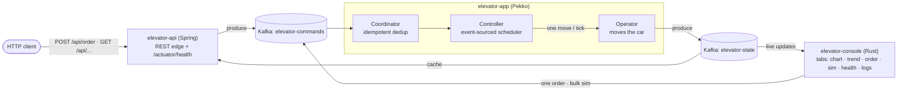
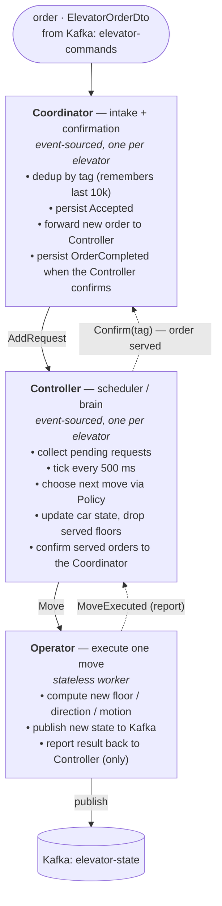
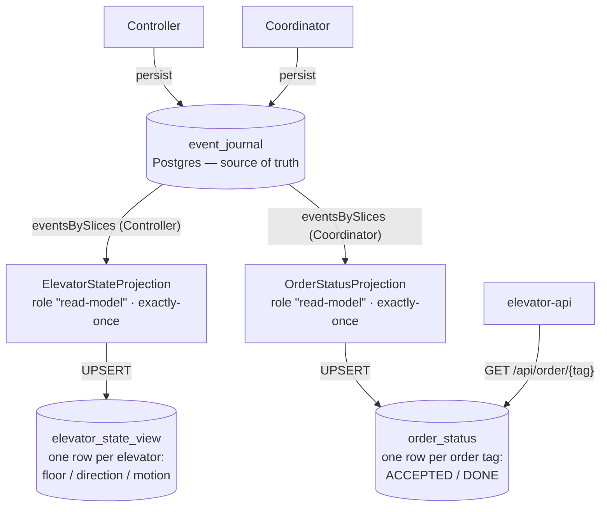

# Elevator System

An event-sourced elevator simulator, built as a hands-on lab for **modern distributed
programming** on (and off) the JVM:

- **Scala 3** — the pure domain (elevator, floors, scheduling policy)
- **Apache Pekko** — typed actors, cluster sharding, event sourcing + projections (the runtime)
- **PostgreSQL** (reactive **R2DBC**) — durable event journal + a CQRS read-model projection
- **Apache Kafka** — the command/state bus (log-centric architecture)
- **Spring Boot** (+ Actuator) — the HTTP edge and health probes
- **Rust** (ratatui) — a retro terminal console that speaks the same Kafka topics

It's grown in small, deliberate commits — read the history to follow the architecture
coming together.

## Architecture



Both the Spring API and the Rust console are independent clients of the same two Kafka
topics — the console talks straight to Kafka, the API adds HTTP on top.

### The actors — who does what

One order flows through three actors, each with a single responsibility. There is one
`Coordinator` and one `Controller` per elevator (cluster-sharded, event-sourced); the
`Operator` is a stateless worker.



| Actor | Responsibility | Tasks |
|-------|----------------|-------|
| **Coordinator** | Order intake **and** confirmation (event-sourced, per elevator) | Drop duplicate orders by `tag` (remembers the last 10k); persist an `Accepted` event; forward each new order to the Controller as `AddRequest`; when the Controller confirms an order is served, persist an idempotent `OrderCompleted(tag)` — one per tag, so duplicate submissions are all covered |
| **Controller** | The per-elevator scheduler / brain (event-sourced, per elevator) | Accumulate pending requests; on a 500 ms `Tick` pick the next move via the pure `Policy`; mark itself "waiting" until the move completes; update the car's state and drop a request once its floor is reached; **tell the Coordinator (`Confirm(tag)`)** when an order is served |
| **Operator** | Execute one physical move (stateless) | Compute the new floor/direction/motion from the `Policy` command; publish the new `ElevatorState` to Kafka `elevator-state`; report `MoveExecuted` back to the Controller (its only collaborator) |
| **ElevatorStateProjection** | Read-side CQRS view (see below) | Replay Controller events by slice; UPSERT one row per elevator into `elevator_state_view` |
| **OrderStatusProjection** | Read-side CQRS view, keyed by order tag | Replay Coordinator events by slice; mark each order `ACCEPTED` then `DONE` in `order_status` (powers `GET /api/order/{tag}`) |

### Persistence & read side (CQRS)

The `Controller` and `Coordinator` are event-sourced into a durable **R2DBC Postgres journal**
(state survives restarts, rebuilt by replaying events). Two **Pekko Projections** read those events
back out by slice and maintain queryable read-models — write side and read side are different
concerns, different tables:



Kafka (the `elevator-state` topic) stays as the **live, ephemeral** broadcast for the API cache
and console; the projections are the **durable, queryable** views derived from the journal.
`OrderStatusProjection` follows the `Coordinator`'s `Accepted`/`Completed` events so the API can
answer **"was the order with tag X processed?"** via `GET /api/order/{tag}`.

### Live vs durable: which source to read?

Two read paths, two jobs — pick by what the consumer needs:

| Consumer need | Read from | Why |
|---|---|---|
| **Online/real-time monitor** (ticking dashboard, console) | **Kafka** `elevator-state` | push-based, sub-second; ephemeral is fine for "now" |
| **Durable query / snapshot / history** (REST, survives restart) | **projection** `elevator_state_view` | complete & correct even right after a restart; queryable with SQL |
| **"Was order X processed?"** (by tag) | **projection** `order_status` via `GET /api/order/{tag}` | per-order lifecycle (ACCEPTED → DONE), durable and indexed by tag |

Best of both for a live UI: **seed** the initial picture once from `elevator_state_view` (so nothing
is blank at startup), then **stream** live updates from the Kafka topic.

| Module                 | Stack   | Role                                                                 |
|------------------------|---------|---------------------------------------------------------------------|
| `elevator-common-core` | Scala 3 | Pure domain: elevator, floors, scheduling `Policy`                   |
| `elevator-common-dto`  | Scala 3 | Messages shared across the wire                                     |
| `elevator-app`         | Pekko   | The brain: event-sourced `Coordinator` / `Controller` / `Operator` + R2DBC journal & read-side projection |
| `elevator-api`         | Spring  | HTTP edge + Actuator health (Kafka readiness check)                 |
| `elevator-console`     | Rust    | Tabbed terminal UI: chart, floor-over-time, single order, bulk `sim` (progress bar), actuator health, log viewer |

## Run

```bash
scripts/demo-up.sh            # infra + both JVMs, seeds a fleet (e1..eN), opens the chart
                              #   PROFILE=test|prod | ELEVATORS=N | FLEET_FILE=scripts/fleet.txt | SEED=N | NO_UI=1
# or run the rich console yourself:
cd elevator-console && cargo run -- monitor      # Tab: chart / trend / order / sim / health / logs
scripts/demo-down.sh          # stop everything

# inspect the durable read-model:
docker exec -i elevator-demo-postgres psql -U elevator -d elevator -c \
  "SELECT * FROM elevator_state_view;"
```

See **[demo.md](demo.md)** for the scripted demo and endpoints, and
**[elevator-console/README.md](elevator-console/README.md)** for the console.

## Build

Maven multi-module, Java 21. `mvn package` builds the JVM modules (a `maven-enforcer`
rule guards dependency convergence). The Rust console is a separate `cargo` build,
wired in behind `-Pconsole` / `-Dcargo.skip=false` — see the console README.

## Why this project exists

A sandbox for the patterns behind resilient distributed systems — the actor model,
event sourcing / CQRS, log-centric messaging, idempotency, backpressure, and
observability — small enough to read in an afternoon, real enough to break on purpose
and learn from.

## Roadmap

**Done:** durable **R2DBC Postgres journal** (state survives restarts) + a **Pekko Projection**
maintaining the `elevator_state_view` read-model, with recovery & schema-evolution tests
(`mvn -pl elevator-app test`).

Next: point the API's read path at the projection (a reactive `GET /elevators` over
`elevator_state_view`) instead of the in-memory Kafka cache, so HTTP queries are durable and
restart-safe. Further out: a multi-node cluster (the projection is already role-gated to
`read-model` nodes), a separate read database, CRDTs (`distributed-data`), and
chaos/fault-injection drills.
