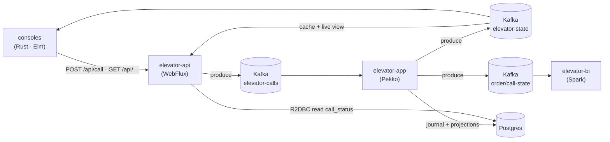
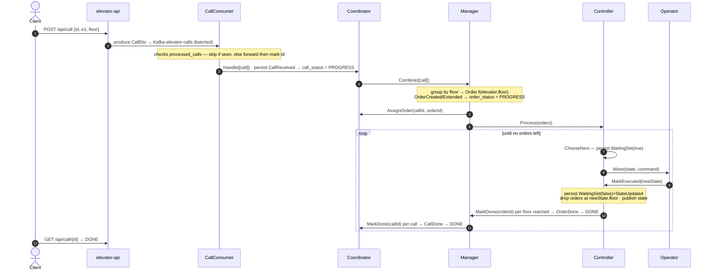
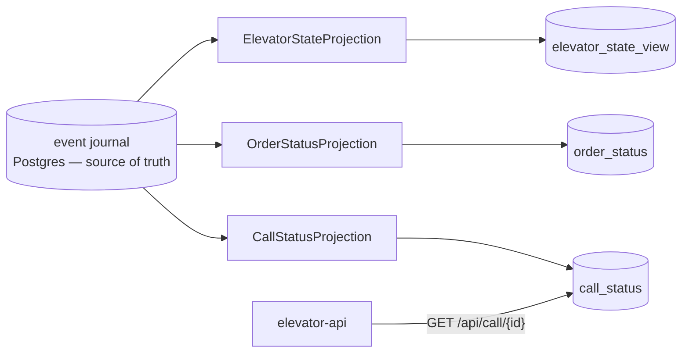

# Elevator System

An event-sourced elevator simulator — a lab for distributed patterns on (and off) the JVM.

- **Scala 3** — the pure domain (elevator, floors, scheduling)
- **Apache Pekko** — typed actors, cluster sharding, event sourcing + projections
- **PostgreSQL / R2DBC** — durable event journal + CQRS read-model
- **Apache Kafka** — the call / state bus
- **Spring WebFlux** — the HTTP edge + health probes
- **Rust (ratatui)** + **Elm** — terminal and browser consoles, both HTTP-only clients of the API

**Call vs Order.** A **call** is a button press (`id, elevatorName, floor`, optional `passengerId`).
The app groups same-floor calls into one living **order** — a stop, `id = f(elevator, floor)`; later
same-floor calls attach until it's done. Reaching a floor serves every order there at once.

If a doc and the code disagree, **trust the code** and fix this file.

---

## Quick start (demo)

The whole backend runs in containers — no host JVMs, no shell scripts. Needs Docker.

```bash
docker compose -f docker-compose.demo.yml up --build         # kafka + postgres + app + api
docker compose -f docker-compose.demo.yml --profile seed up  # …and seed a fleet of calls (one-shot)
docker compose -f docker-compose.demo.yml logs -f app api    # follow the JVM logs
docker compose -f docker-compose.demo.yml down               # stop (add -v to wipe data)
```

Seed knobs (`--elevator-count`, `--max-floor`, `--count`) live in the `seed` service's `command:`.
Kafka has no volume, so a restart wipes the live chart (the Postgres journal keeps the actors) — the
`seed` profile fires a burst of calls after boot. The durable read-model survives a restart:

```bash
docker exec -i elevator-demo-postgres psql -U elevator -d elevator -c \
  "SELECT elevator_name, floor, direction, motion FROM elevator_state_view;"
```

## Watch it live

Two read-only consoles, both talking to the system **only over HTTP** (never Kafka):

- **Rust TUI** (`elevator-console-cli`) — tabs: chart · trend · call · sim · health · logs · k8s.
  `cd elevator-console-cli && cargo run -- monitor` (or `watch` to stream to stdout). The k8s tab
  hot-swaps the engine (`f`/`s`) and rolls pods via `kubectl`; the sim tab fires N random calls.
- **Elm browser** (`elevator-console-web`) — Chart / Trend / Stats tabs on ECharts, live over SSE.
  `cd elevator-console-web && npm install && npm start` (proxies `/api` to `localhost:8080`).

Headless helpers on the CLI: `selftest` (health + state → pass/fail), `itest --count 20` (fire
calls, poll each to DONE, cross-check `kubectl` logs), `simulate --count 10000` (bulk load).

## Endpoints

Default port **8080**.

| Method | Path | Purpose |
|---|---|---|
| `POST` | `/api/call` | Body `{"elevatorName":"e1","floor":5}` → publishes a call. `id` optional (auto UUID). Optional unverified `passengerId` (no auth yet). |
| `GET` | `/api/elevator` | Latest state of every known elevator. |
| `GET` | `/api/elevator/{name}` | Latest state JSON, or `404`. |
| `GET` | `/api/elevator/stream` | **SSE** live state stream. |
| `GET` | `/api/call/{id}` | Call lifecycle `PROGRESS → DONE`, or `404`. |
| `GET` | `/api/config` | Fleet + max floor (consoles fetch it — no hardcoded limits). |
| `GET` | `/api/version` | Running version. |
| `GET` | `/api/mileage`, `/api/served` | BI stats (only when BI is on, else `404`). |
| `GET` | `/actuator/health` | Health incl. Kafka readiness. |

---

## Architecture

Six modules. `elevator-common` keeps a clean layering; app actors are **thin shells** wiring the
pure logic: `core (domain + engine) → events → logic (decide/evolve) → protocol → strategy → dto`.

| Module | Stack | Role |
|---|---|---|
| `elevator-common` | Scala 3 | Shared library, small Pekko-free submodules (layering above). |
| `elevator-app` | Pekko | The brain: event-sourced actors + R2DBC journal + projections. |
| `elevator-api` | Spring WebFlux | HTTP edge: REST + SSE, Kafka producer/consumer, R2DBC reads. No actors. |
| `elevator-console-cli` | Rust (ratatui) | Terminal dashboard + call sender. |
| `elevator-console-web` | Elm | Read-only browser monitor. |
| `elevator-bi` | Scala 2.12 / Spark | **Standalone** batch job → Parquet, read by the api via DuckDB. |



**Kafka topics** (all keyed by `elevatorName`): `elevator-calls` (api → app), and three app → out
feeds `elevator-state` (api cache, consoles, BI), `elevator-order-state`, `elevator-call-state` (BI).

### The four actors

One elevator = **four actors**. Three **remember** (event-sourced — state is the fold of their
events); the **Operator** is a stateless worker. `[evt]` = stored to the journal, `[pub]` = published
to Kafka.

| Actor | State | Contract |
|---|---|---|
| **Coordinator** | `Map[CallId, Floor]` | owns **call status**. `Handle` → `[evt]CallReceived` `[pub]`PROGRESS → Manager; `AssignOrder` → `[evt]CallAssigned`; `MarkDone` → `[evt]CallDone` `[pub]`DONE |
| **Manager** | `Map[OrderId, Order]` | owns **call ↔ order**. `Combine` → `[evt]OrderCreated\|Extended` `[pub]`PROGRESS → Coordinator + Controller; `MarkDone` → `[evt]OrderDone` `[pub]`DONE |
| **Controller** | `waiting · state · Set[Order]` | owns **movement**. `Process` → `[evt]OrderAccepted`; `ChooseNext` → `[evt]WaitingSet(true)` → Operator; `MarkExecuted` → `[evt]WaitingSet(false)+StateUpdated` `[pub]`elevator |
| **Operator** | — (stateless) | one move. `Move` → no event → `Controller.MarkExecuted` |

The **Controller drives its own loop** — after each move it self-sends `ChooseNext`. The engine
paces it (real travel time), not a timer.



`ChooseNext` + `WaitingSet` make the move loop persisted messages, so a crash mid-move re-issues the
move on recovery — a blocking loop cannot. Actors speak only domain types; `CallConsumer` maps
`CallDto → Call` at the edge, so no DTOs leak inside.

### Scheduling & the move gate

The Controller picks the next move with a pure **SCAN** (`NextFloorStrategy.default`): keep going the
same way while a target is ahead, else reverse, else stop. `GroupCallsStrategy` does the same-floor
grouping. `Engine.cost` busy-spins to simulate travel — **the system's only pacing** (`SlowEngine`
2s realistic, `FastEngine` 100ms for tests/demo). Only the app layer touches `core.engine`.

Before each move the Controller **asks** a `SuspendManager` cluster **singleton** whether the car may
proceed (you can't block inside an event-sourced actor, so the answer returns as a command). Default
policy is **always allow**. If **another car is on the same floor**, it doesn't deny — it **holds**
the reply for `SuspendDwell` (3s) then releases: both cars pause once, then both go (soft stagger, no
livelock). Ask timeout is `dwell + 2s` so the delayed "go" beats a false `MoveRetry`.

## Read model (CQRS)

The journal is the source of truth (write side). Three exactly-once Pekko projections (role-gated to
`read-model` nodes) replay it into queryable tables. Kafka `elevator-state` stays the **live,
ephemeral** feed.



| Need | Read from |
|---|---|
| Live dashboard / console | Kafka `elevator-state` — push, sub-second, "now" only |
| Durable snapshot / after restart | `elevator_state_view` — SQL-queryable |
| "Was call/order X done?" | `call_status` / `order_status` — per-item lifecycle, indexed |

> The api currently serves live `GET /api/elevator` from its in-memory Kafka-fed store, not from
> `elevator_state_view`. Pointing it at the durable view is the next step.

## Crash recovery

Event sourcing rebuilds actor state by replaying the journal. Two handoffs **leave** the journal —
to the stateless Operator and to the dedup table — so each needs a guard:

- **Controller** — `WaitingSet(true)` is durable but the `Move` went to the stateless Operator. On
  `RecoveryCompleted` the Controller re-asks the suspender and re-issues the move; the latch is still
  set, so no duplicate. Ask fails → `MoveRetry`. **The only move redelivery — no wall-clock watchdog.**
- **Ingress** — `CallConsumer` **checks** `processed_calls` up front to drop re-sent ids, forwards,
  and only **then** marks the id (offset commits after). Claim-first would lose a call that crashed
  between claim and commit; claim-last just reprocesses, and the exactly-once projection UPSERTs by id.

**Three groupings — don't confuse them:** ingress dedup (`CallConsumer` + `processed_calls`, keyed by
call **id**, drops Kafka redeliveries) · same-floor grouping (`Manager` + `GroupCallsStrategy`, keyed
by **floor**) · passenger tally (`Manager` per order, keyed by **person** — `passengers` vs.
`anonymous`). The Coordinator itself is **not** idempotent; dedup lives at ingress and in the UPSERT.

## Auth (none yet)

**There is no authentication.** Every endpoint is open. `passengerId` on `POST /api/call` is an
optional, **unverified** claim (absent/blank → anonymous) — a placeholder for a future login.

---

## Config (live-tunable)

All app params live in one ConfigMap, `elevator-config` (rendered from `charts/elevator`). Editing it
hot-reloads the tunables in-process — **no pod restart** (~5s poll).

- **Call validation** — the api rejects `400` on a bad floor (`ELEVATOR_MAXFLOOR`, 15) or unknown
  elevator (`ELEVATOR_ELEVATORS`, e1..e10). The api owns the limits; the app never validates. A
  missing ConfigMap makes the api fail to start.
- **Engine fast / slow** — `ELEVATOR_ENGINE`. **BI on / off** — `ELEVATOR_BI_ENABLED`.

## Test

```bash
./mvnw test          # unit: logic, strategy, event evolution, actor recovery, serialization
./mvnw verify        # + Testcontainers IT (boots Spring + Kafka + Postgres)
```

The Rust console is the end-to-end harness (`selftest` / `itest`, HTTP + `kubectl` log cross-check).
**Commit gate:** a pre-commit hook runs `itest` and blocks on failure — enable once with
`git config core.hooksPath scripts/hooks`. It skips when the kind cluster is unreachable, or with
`SKIP_ITEST=1 git commit …`.

## Run on a cluster (kind)

Three tools, one job each — no overlap, no shell scripts.

| Tool | Owns |
|---|---|
| **Terraform** (`terraform/`) | kind cluster, Calico CNI, api TLS keystore secret, ghcr pull secret |
| **Helm** (`charts/elevator/`) | every k8s object + the `engine` / `bi.enabled` / `seed` toggles |
| **Skaffold** (`skaffold.yaml`) | build images → load into kind → deploy the chart → port-forward |

```bash
cd terraform && terraform init && terraform apply && cd ..   # provision once (writes the CA the console bundles)
skaffold run                 # build + deploy   ·   or:  skaffold dev  (rebuild + port-forward :8080)
skaffold run -p bi           # Spark BI on   ·   -p full → api:2 + BI (needs a bigger node)
helm upgrade elevator charts/elevator --reuse-values --set config.engine=slow   # hot-swap the engine
```

Run `terraform apply` **before** Skaffold. Tear down with `terraform destroy` — **never** `kind
delete`, or Terraform's state drifts. Prereqs: `terraform`, `helm`, `skaffold`, `kind`, `docker`,
`kubectl`, `mvn`.

**BI layer.** `elevator-bi` is a Spark **CronJob** (`bi.schedule`, default `*/15`); each tick a driver
pod spawns 2 executors, does one pass, and exits. It reads `elevator-state` (Kafka) for mileage and
`order_status` (JDBC, `status='DONE'`) for orders-served, joins to one row per elevator, and atomically
overwrites `elevators.parquet` on a shared `hostPath` — the api reads it via DuckDB. It's **standalone**
(own pom, outside the reactor) and pinned to **Scala 2.12** because Spark has no Scala 3 build.
`kubectl create job --from=cronjob/elevator-stats stats-now` triggers a run immediately.

**Install the console via apt** — the Rust console ships as a signed `.deb` from a local apt repo:

```bash
cd elevator-console-cli && scripts/apt-repo.sh   # build .deb + sign + index target/apt-repo/ (idempotent)
REPO=elevator-console-cli/target/apt-repo
sudo install -m0644 "$REPO/elevator-console.gpg" /etc/apt/keyrings/elevator-console.gpg
echo "deb [signed-by=/etc/apt/keyrings/elevator-console.gpg] file://$REPO ./" \
  | sudo tee /etc/apt/sources.list.d/elevator-console.list
sudo apt update && sudo apt install elevator-console-cli
```

---

## CI / CD

Two GitHub Actions workflows; **Build & Test** gates **Release & Deploy** — a red build never ships.

- **Build & Test** (`ci.yml`, push + PR) — **jvm** (Temurin 21): `validate` → `install -DskipITs` →
  `verify` (Testcontainers IT). **rust**: `fmt --check`, `clippy -D warnings`, `test`, `--release` —
  Maven never compiles the console, so **CI is the only Rust gate**. **images** (PR only, no push).
- **Release & Deploy** (`cd.yml`, tag-only via release-please) — a push to `main` never deploys. On a
  `v*` tag: **publish** pushes `ghcr.io/<owner>/elevator-{app,api,console-web,bi}` (`:version` +
  `latest`) + a GitHub Release, then **deploy** runs `helm upgrade --install` (images pinned) on a
  self-hosted runner on the kind host (cloud runners can't reach local kind).

## Versioning

One version for the whole app in one file — **`VERSION`** at the repo root. You never edit it by
hand; **release-please** bumps it from commit messages. Because the repo squash-merges, the **PR
title** is what it reads (a CI check enforces Conventional Commits): `fix:` → patch, `feat:` /
`feat!:` → minor, `chore:` / `docs:` / `refactor:` → no release on their own (pre-1.0).

release-please keeps a **release PR** open that bumps `VERSION` + every module version + the
changelog. Merge it → it tags `vX.Y.Z` → `cd.yml` publishes and deploys. `ci.yml` fails if any module
version ≠ `VERSION`; `cd.yml` refuses a mismatched tag. Helm `Chart.yaml` version is packaging
metadata, deliberately **not** in lockstep.

## Build notes

- Maven multi-module, Java 21 — `./mvnw package`. The Rust console is a separate `cargo` build behind
  `-Pconsole` (opt-in). The Elm console builds with a project-local Node via `frontend-maven-plugin`
  (no global Node needed; `-Dnpm.skip=true` to skip it).
- `elevator-bi` is outside the reactor: `./mvnw -f elevator-bi/pom.xml package`.
- **Docs → PDF:** `./mvnw -Ppdf package` renders this README (Mermaid diagrams included) to
  `target/README.pdf` via `scripts/md-to-pdf.sh`. Opt-in — it needs `pandoc`, Node (`npx`), and a
  Chromium; a plain build never requires them.
- `pekko-persistence-r2dbc` needs an explicit `org.postgresql:r2dbc-postgresql` dependency — missing
  it fails only at runtime.
- Renaming an actor message trait means also editing the string FQNs in `application.conf`
  (`serialization-bindings`) — only runtime catches a mismatch.

Source map: actors in `elevator-app/.../actors/`; protocol/events/logic/strategy in the matching
`elevator-common-*` submodules; ingress dedup in `elevator-app/.../inbound/`; projections in
`.../readside/`; the move gate in `SuspendManager.scala` (gated in `Controller.scala`).
