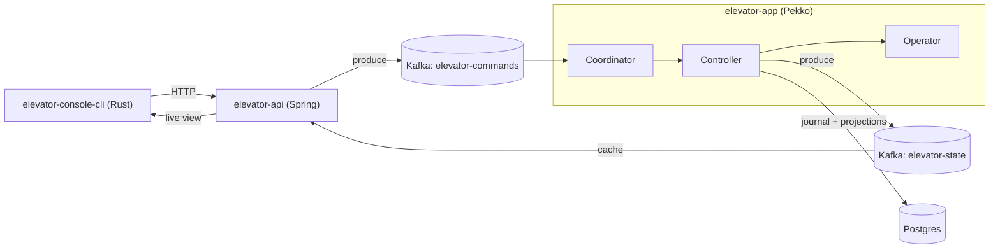

# Elevator System

An event-sourced elevator simulator — a hands-on lab for modern distributed patterns on (and
off) the JVM:

- **Scala 3** — the pure domain (elevator, floors, scheduling policy)
- **Apache Pekko** — typed actors, cluster sharding, event sourcing + projections
- **PostgreSQL / R2DBC** — durable event journal + a CQRS read-model
- **Apache Kafka** — the command/state bus
- **Spring Boot** — the HTTP edge + health probes
- **Rust (ratatui)** — a retro terminal console (HTTP client of the API)

Built in small, deliberate commits — read the history to watch it come together.



## Quick start

```bash
scripts/demo-up.sh          # infra + both JVMs, seeds a fleet, opens the chart
scripts/demo.sh lift-a 5    # order an elevator, watch it arrive
scripts/demo-down.sh
```

Build: Maven multi-module, Java 21 — `mvn package`. The Rust console is a separate `cargo`
build behind `-Pconsole`.

## Docs

Full documentation is in **[docs/](docs/README.md)** — one topic per file:

| Understand | Reference | Do |
|---|---|---|
| [architecture](docs/architecture.md) · [read-model](docs/read-model.md) · [crash-recovery](docs/crash-recovery.md) | [actors](docs/actors.md) · [protocol](docs/protocol.md) · [scheduling](docs/scheduling.md) · [core](docs/core.md) · [ci/cd](docs/cicd.md) | [run & endpoints](docs/run.md) · [dev worktrees](docs/dev-worktrees.md) |

## Why it exists

A sandbox for the patterns behind resilient distributed systems — the actor model, event
sourcing / CQRS, log-centric messaging, idempotency, observability — small enough to read in
an afternoon, real enough to break on purpose and learn from.

**Roadmap.** Done: durable R2DBC journal + a Pekko projection maintaining `elevator_state_view`
(with recovery & schema-evolution tests). Next: point the api's read path at that projection so
HTTP queries are restart-safe. Further out: multi-node cluster, a separate read database, CRDTs
(`distributed-data`), chaos drills.
