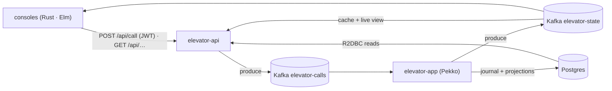

# Elevator System

An event-sourced elevator simulator — a **lab for distributed patterns** on (and off) the JVM.
Read it to learn how the pieces fit; if a doc and the code disagree, **trust the code** and fix this file.

The **pure domain** (elevator, floors, scheduling) is **Scala 3**; **Apache Pekko** runs it as typed,
cluster-sharded, event-sourced actors with projections over a **PostgreSQL / R2DBC** journal + CQRS
read-model; **Kafka** is the call / state bus; **Spring WebFlux** is the HTTP edge (REST + SSE, JWT, health);
and two consoles — **Rust (ratatui)** + **Elm** — are HTTP-only clients of the api.

**One idea to hold onto — Call vs Order.** A **call** is a button press (`elevatorName, floor`, optional
`passengerId`). The app groups same-floor calls into one living **order** — a stop with `id = f(elevator,
floor)`; later same-floor calls attach until it's done. Reaching a floor serves every order there at once.

## Run it

```bash
docker compose -f docker-compose.demo.yml up --build         # kafka + postgres + app + api
docker compose -f docker-compose.demo.yml --profile seed up  # fire a fleet of calls (one-shot)
docker compose -f docker-compose.demo.yml down               # stop (add -v to wipe volumes)
```

Watch it live — two consoles, each with **Chart · Trend · Sim** tabs, both talking to the api **only over
HTTP** (never Kafka):

- **Rust TUI** — `cd elevator-console-cli && cargo run -- monitor` (`watch` streams to stdout).
- **Elm browser** — `cd elevator-console-web && npm install && npm start` (proxies `/api` to `:8080`).

The **Sim** tab triggers a server-side run via `POST /api/simulate` (see below).

## Endpoints

Port **8080**. `POST /api/call` and `POST /api/board` need a Bearer JWT; everything else is open.

| Method · Path | Purpose |
|---|---|
| `POST /api/call` | **JWT required.** `{"elevatorName":"e1","floor":5}` → a call. `passengerId` = token `sub` (body value ignored). |
| `POST /api/board` | **JWT required.** `{"elevatorName":"e1","floor":5}` → the passenger (`sub`) stepped in; closes the open door. |
| `POST /api/token` | Dev issuer: `{"subject":…}` + `X-Client-Secret` → signed RS256 JWT. `GET /oauth2/jwks` publishes the key. |
| `GET /api/elevator[/{name}]` | Latest state — all, or one (`404`). `/stream` is an SSE live feed. |
| `GET /api/call/{id}` | Call lifecycle `PROGRESS → DONE`, or `404`. |
| `POST /api/simulate` | Burst of 100 calls → `{runId, count, ids}`; `GET /api/simulate/progress?runId=` for the rollup. |
| `GET /api/config`, `/api/version` | Fleet + max floor · running version. |
| `GET /api/stats/…` | All BI under `/api/stats`: `/mileage` `/served` `/latency` (+`/calls`) `/conflicts` (`404` when BI is off). |
| `GET /actuator/health` | Health incl. Kafka readiness. |

**Auth.** Identity is proven, not claimed: `POST /api/call` sets `passengerId` from the token's `sub`;
no/invalid token → **401**. Enforcement lives **only in `elevator-api`** — the app / Kafka layer is
untouched. `POST /api/token` is a dev stand-in for a real login (RS256, `elevator.auth.*`: `token-ttl-seconds`
300, `client-secret` = `ELEVATOR_CLIENT_SECRET`). The signing key is in-process, so multiple api replicas
reject each other's tokens — mount a fixed key as a Secret before scaling past one.

## How it's built

`elevator-common` keeps a clean, Pekko-free layering (`core → events → logic (decide/evolve) → protocol →
strategy → dto`); app actors are **thin shells** over that pure logic.

| Module | Stack | Role |
|---|---|---|
| `elevator-common` | Scala 3 | Shared pure library (the submodules above). |
| `elevator-app` | Pekko | The brain: event-sourced actors + R2DBC journal + projections. |
| `elevator-api` | Spring WebFlux | HTTP edge: REST/SSE, Kafka in/out, R2DBC reads, JWT. No actors. |
| `elevator-sim` | Scala 3 | Load engine behind `POST /api/simulate`. |
| `elevator-console-cli` / `-web` | Rust / Elm | Terminal / browser consoles. |
| `elevator-bi` | Scala 2.12 / Spark | **Standalone** batch job → one Parquet fact table, read by the api via DuckDB. |



Topics are keyed by `elevatorName`: `elevator-calls` + `elevator-board` (api → app) and app → out `elevator-state`
(api/consoles/BI) plus `elevator-order-state` / `elevator-call-state` (BI only).

### The actors

One elevator = **four core actors**. Three **remember** (event-sourced — state is the fold of their events);
the **Operator** is a stateless worker. Each move flows Coordinator → Manager → Controller → Operator and back.

| Actor | Owns | Key messages |
|---|---|---|
| **Coordinator** | call status (`Map[CallId, Floor]`) | `Handle`→`CallReceived` (PROGRESS); `AssignOrder`→`CallAssigned`; `MarkDone`→`CallDone` (DONE) |
| **Manager** | call ↔ order (`Map[OrderId, Order]`) | `Combine`→`OrderCreated/Extended` (PROGRESS); `MarkDone`→`OrderDone` (DONE), frees passengers |
| **Controller** | movement (`waiting · state · Set[Order]`) | `Process`→`OrderAccepted`; `ChooseNext`→`WaitingSet(true)`; `MarkExecuted`→`ElevatorStateUpdated` (+ publish) |
| **Operator** | — (stateless) | `Move` → no event → `Controller.MarkExecuted` |

The Controller **drives its own loop**: after each move it self-sends `ChooseNext`. Pacing is real travel
time — `Engine.cost` busy-sleeps (`SlowEngine` 2s, `FastEngine` 100ms), the system's only clock, not a timer.
Because `ChooseNext`/`WaitingSet` are persisted, a crash mid-move re-issues the move on recovery — a blocking
loop couldn't. Actors speak only domain types; `CallConsumer` maps `CallDto → Call` at the edge.

### The four patterns worth studying

- **Scheduling** — the Controller picks the next stop with a pure **SCAN** (`NextFloorStrategy`): keep going
  while a target is ahead, else reverse, else stop. `GroupCallsStrategy` does the same-floor grouping.
- **One lift per passenger** — identified calls pass through a `PassengerManager` entity **keyed by
  `passengerId`** (every other write actor is keyed by `elevatorName`). It enforces the invariant by
  *ordering*, not rejecting: free → forward + mark busy; busy → **freeze** the call in a FIFO queue; freed
  (on `OrderDone`) → release the next frozen call. Single-writer per passenger, so it holds across replicas.
  The queue is event-sourced (a consumed call is gone from Kafka). Anonymous calls skip the gate.
- **Move gate** — before each move the Controller **asks** a `SuspendManager` cluster **singleton** (you
  can't block inside an event-sourced actor, so the answer returns as a command). Default policy: always
  allow. If another car is already on the same floor it **holds** the second asker's reply for `SuspendDwell`
  (3s) then releases it — a soft stagger, no livelock. Ask timeout `dwell + 2s`; on failure → `MoveRetry`.
- **Waiting on a real user action** — on a served arrival the Controller hands off to a `Doorman` entity that
  **opens the door and waits for the passenger to actually board**, not a fixed dwell. The boarding signal is a
  real ingress mirroring calls: `POST /api/board {elevatorName, floor}` (passenger JWT → subject) → `BoardService`
  produces a `BoardDto` to the `elevator-board` topic → `BoardConsumer` delivers `Doorman.Boarded`. That closes
  the door at once; a no-show is bounded by a `BoardTimeout` (`door-dwell`). Either way `Closed` loops back as
  `Controller.DoorClosed` to resume. The wait is a **timer-backed state**, not a blocked thread, so the Doorman
  stays free to receive the message (no `elevator-blocking-dispatcher`). This is the reference pattern for a
  Pekko actor waiting on an external action: model the wait as a state, turn the action into a message at the
  edge, always pair it with a timeout. `BoardingLab` (`elevator-app/.../lab/BoardingLab.scala`) runs the same
  handshake in-process (real `Doorman`, `Simulator` playing boarders vs no-shows):
  ```bash
  ./mvnw -q -pl elevator-app -am -DskipTests package
  java -cp elevator-app/target/elevator-app-*.jar pl.feelcodes.elevator.app.lab.BoardingLab 7
  ```

**Crash recovery.** Two handoffs *leave* the journal, so each has a guard. The **Controller** re-asks the
suspender and re-issues the move on `RecoveryCompleted` (the latch is still set → no duplicate; the only move
redelivery, no wall-clock watchdog). **Ingress** — `CallConsumer` **checks** `processed_calls` up front, forwards,
then marks the id (offsets commit after); claim-last just reprocesses and the projections UPSERT by id.
Don't confuse the three groupings: ingress dedup (by call **id**), same-floor grouping (by **floor**),
passenger tally (by **person**).

### Read model (CQRS)

The journal is the write-side source of truth. Three exactly-once Pekko projections (role-gated to `read-model`
nodes) replay it into queryable tables — `ElevatorStateProjection → elevator_state_view`, `OrderStatusProjection
→ order_status`, `CallStatusProjection → call_status`. So: live dashboard → Kafka `elevator-state` (push, "now"
only); durable snapshot → `elevator_state_view`; "was call/order X done?" → `call_status` / `order_status`
(what `GET /api/call/{id}` reads). The api still serves live state from its in-memory Kafka store, not the
durable view — pointing it there is the next step.

## Config, test, ship

**Config** — all app params live in one ConfigMap `elevator-config` (from `charts/elevator`); editing it
hot-reloads in-process (~5s poll, no restart). The api validates calls — `400` on a bad floor
(`ELEVATOR_MAXFLOOR`, 15) or unknown elevator (`ELEVATOR_ELEVATORS`, e1..e10); the app never validates, and a
missing ConfigMap makes the api fail to start. `ELEVATOR_ENGINE` (fast/slow) and `ELEVATOR_BI_ENABLED` are hot.

**Test** — `./mvnw test` (unit: logic, strategy, evolution, recovery, serialization, auth) · `./mvnw verify`
(+ Testcontainers IT: Spring + Kafka + Postgres). The Rust console is the e2e harness: `selftest`, `itest
--count 20` (fire calls, poll to DONE, cross-check `kubectl` logs). A pre-commit hook runs `itest`
(`git config core.hooksPath scripts/hooks`); it skips when kind is unreachable or with `SKIP_ITEST=1`.

**Run on kind** — three tools, one job each, no shell scripts:

| Tool | Owns |
|---|---|
| **Terraform** (`terraform/`) | kind cluster, Calico CNI, api TLS secret, ghcr pull secret |
| **Helm** (`charts/elevator/`) | every k8s object + `engine` / `bi.enabled` / `seed` toggles |
| **Skaffold** | build images → load into kind → deploy chart → port-forward |

```bash
cd terraform && terraform init && terraform apply && cd ..   # provision once (writes the CA the console bundles)
skaffold run                 # build + deploy   ·   skaffold dev = rebuild + port-forward :8080
skaffold run -p bi           # Spark BI on   ·   -p full = api:2 + BI (needs a bigger node)
```

`terraform apply` **before** Skaffold; tear down with `terraform destroy`, **never** `kind delete` (state drifts).
Kafka and Postgres each get a PVC, so a restart keeps both the feed and the journal.

**BI** — `elevator-bi` is a standalone Spark **CronJob** (`bi.schedule` `*/15`, Scala 2.12 — Spark has no
Scala 3 build): each tick writes **one detailed Parquet fact table** (`elevator-facts.parquet`, grain-tagged
`ELEVATOR`/`ORDER`/`CALL` rows) on a shared `hostPath`. The api reads that single file via DuckDB and computes
every stat as a **view** — mileage, orders-served, call processing time (avg/p50/p95), and the
one-lift-per-passenger audit — all under `/api/stats`.

**Install the console** — the Rust console ships as a signed `.deb` from an apt repo on GitHub Pages
(`https://twistedlady.github.io/elevator-system/apt`, published by `apt-repo.yml` on each
`elevator-console-cli-v*` tag): add the keyring + `signed-by` source, then `apt install elevator-console-cli`.

## CI/CD, versioning, build

`ci.yml` (push + PR) gates `cd.yml` — a red build never ships. CI runs the JVM build (`validate → install
-DskipITs → verify`, Temurin 21) and the Rust console (`fmt`, `clippy -D warnings`, `test`, `--release`) —
Maven never compiles the console, so CI is its only gate. `cd.yml` is tag-only: a `v*` tag publishes
`ghcr.io/<owner>/elevator-{app,api,console-web,bi}` + a Release, then `helm upgrade --install` on a self-hosted
runner (cloud runners can't reach local kind). Versioning is one **`VERSION`** file, bumped by **release-please**
from the squash-merged PR title (`fix:`→patch, `feat:`→minor); the pom uses `${revision}`.

Build with `./mvnw package` (Java 21); the Rust console is behind `-Pconsole`, `elevator-bi` is outside the
reactor, `./mvnw -Ppdf package` renders this README to PDF. Build gotchas for agents live in `CLAUDE.md`.
