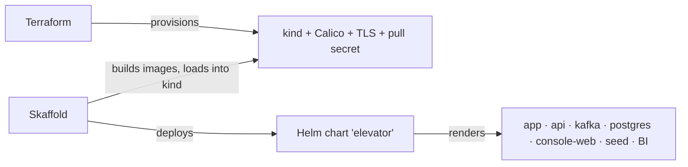
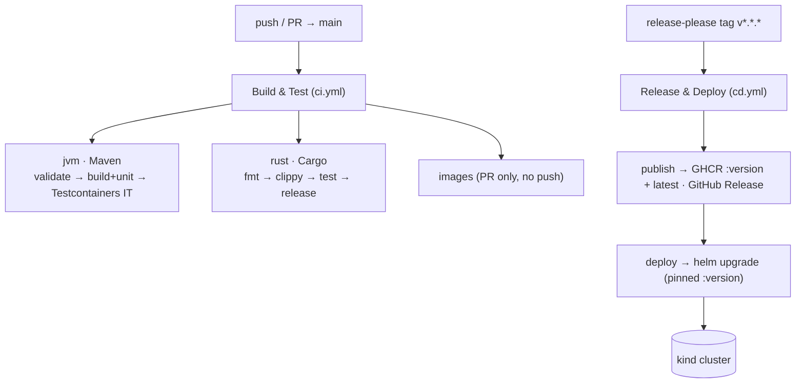

# Elevator System

An event-sourced elevator simulator — a lab for distributed patterns on (and off) the JVM.

- **Scala 3** — the pure domain (elevator, floors, scheduling)
- **Apache Pekko** — typed actors, cluster sharding, event sourcing + projections
- **PostgreSQL / R2DBC** — durable event journal + CQRS read-model
- **Apache Kafka** — the call / state bus
- **Spring WebFlux** — the HTTP edge + health probes
- **Rust (ratatui)** — a terminal console (HTTP client of the API)

Users press buttons — **calls**; the app groups same-floor calls into one **order** (a stop).
How it all fits together: **[DOC.md](DOC.md)** (architecture + actor contract).

---

## Quick start (demo)

The whole backend runs in containers — no host JVMs, no shell scripts. Needs Docker.

```bash
docker compose -f docker-compose.demo.yml up --build        # kafka + postgres + app + api
docker compose -f docker-compose.demo.yml --profile seed up  # …and seed a fleet of calls (one-shot)
docker compose -f docker-compose.demo.yml logs -f app api    # follow the JVM logs
docker compose -f docker-compose.demo.yml down               # stop (add -v to wipe data)
```

Seed knobs (`--elevator-count`, `--max-floor`, `--count`) live in the `seed` service's
`command:` in `docker-compose.demo.yml`.

> **Why seed:** Kafka has no volume, so a restart wipes the live feed and the chart starts blank
> (the Postgres journal still has the actors). The `seed` profile fires a burst of calls after boot.

The durable read-model survives a restart, unlike the Kafka cache:

```bash
docker exec -i elevator-demo-postgres psql -U elevator -d elevator -c \
  "SELECT elevator_name, floor, direction, motion FROM elevator_state_view;"
```

## Watch it live

The **Rust console** is the rich view — a TUI with tabs: chart · trend · call · sim · health ·
logs · k8s. It talks to the system **only over HTTP**.

```bash
cd elevator-console-cli && cargo run -- monitor      # or: … watch  (stream to stdout)
```

## Endpoints

Default port **8080**.

| Method | Path | Purpose |
|---|---|---|
| `POST` | `/api/call` | Body `{"elevatorName":"e1","floor":5}` → publishes a call. `id` optional (auto UUID). Optional unverified `passengerId` (no auth yet). |
| `GET` | `/api/elevator` | Latest state of every known elevator. |
| `GET` | `/api/elevator/{name}` | Latest state JSON, or `404`. |
| `GET` | `/api/elevator/stream` | **SSE** live state stream. |
| `GET` | `/api/call/{id}` | Call lifecycle `PROGRESS → DONE`, or `404`. |
| `GET` | `/api/config` | Fleet + max floor (consoles fetch it — no hardcoded limits). |
| `GET` | `/api/version` | Running version. |
| `GET` | `/api/mileage`, `/api/served` | BI stats (only when BI is on, else `404`). |
| `GET` | `/actuator/health` | Health incl. Kafka readiness. |

## Config (live-tunable)

All app params live in one ConfigMap, `elevator-config` (rendered from `charts/elevator`). Editing
it hot-reloads the tunables in-process — **no pod restart** (~5s in-app poll).

- **Call validation** — the api rejects (`400`) a bad floor (`ELEVATOR_MAXFLOOR`, 15) or unknown
  elevator (`ELEVATOR_ELEVATORS`, e1..e10). The api owns the limits; the app never validates. A
  missing ConfigMap makes the api fail to start (no baked-in default).
- **Engine fast / slow** — `ELEVATOR_ENGINE`. Flip from the console K8s tab (`f`/`s`) or
  `kubectl edit configmap elevator-config`; the app hot-swaps on the next move.
- **BI on / off** — `ELEVATOR_BI_ENABLED` toggles the Spark analytics layer.

## Test

```bash
./mvnw test          # unit: logic, strategy, event evolution, actor recovery, serialization
./mvnw verify        # + Testcontainers IT (boots Spring + Kafka + Postgres)

# the console is the end-to-end harness (HTTP + kubectl log cross-check, no Kafka):
elevator-console-cli selftest                       # api health UP + state flowing → PASS/FAIL
elevator-console-cli itest --count 20 --timeout 90  # send N calls, poll each to DONE, cross-check logs
```

**Commit gate:** a pre-commit hook runs `itest` and blocks the commit on failure. Enable once with
`git config core.hooksPath scripts/hooks`. It skips (not blocks) when the kind cluster is
unreachable, or with `SKIP_ITEST=1 git commit …`.

---

## Run on a cluster (kind)

Three tools, one job each — no overlap, no shell scripts.



| Tool | Owns |
|---|---|
| **Terraform** (`terraform/`) | kind cluster, Calico CNI, api TLS keystore secret, ghcr pull secret |
| **Helm** (`charts/elevator/`) | every k8s object + the `engine` / `bi.enabled` / `seed` toggles |
| **Skaffold** (`skaffold.yaml`) | build images → load into kind → deploy the chart → port-forward |

```bash
cd terraform && terraform init && terraform apply && cd ..   # provision once (kind + Calico + TLS)
skaffold run                 # build + deploy   ·   or:  skaffold dev  (rebuild on change)
```

`terraform apply` writes the CA the console bundles, so run it **before** Skaffold. `skaffold dev`
port-forwards the api to `localhost:8080`. Prereqs: `terraform`, `helm`, `skaffold`, `kind`,
`docker`, `kubectl`, `mvn`.

Toggles (no scripts):

```bash
skaffold run -p bi                              # Spark BI on
skaffold run -p full                            # production shape: api:2, BI on (needs a bigger node)
helm upgrade elevator charts/elevator --reuse-values --set config.engine=slow  # hot-swap the engine
```

Tear down with `terraform destroy` — **never** `kind delete`, or Terraform's state drifts.

## Install the console via apt

The Rust console ships as a Debian package from a signed, local apt repo.

```bash
cd elevator-console-cli && scripts/apt-repo.sh   # build .deb + sign + index target/apt-repo/ (idempotent)

REPO=elevator-console-cli/target/apt-repo        # wire it in once (needs sudo)
sudo install -m0644 "$REPO/elevator-console.gpg" /etc/apt/keyrings/elevator-console.gpg
echo "deb [signed-by=/etc/apt/keyrings/elevator-console.gpg] file://$REPO ./" \
  | sudo tee /etc/apt/sources.list.d/elevator-console.list

sudo apt update && sudo apt install elevator-console-cli
```

`signed-by` scopes the key to this one repo. Upgrade: bump `Cargo.toml` `version`, re-run
`apt-repo.sh`, then `apt install --only-upgrade elevator-console-cli`.

---

## CI / CD

Two GitHub Actions workflows. **Build & Test** gates **Release & Deploy** — a red build never ships.



**Build & Test — `ci.yml`** (push + PR to `main`):

- **jvm** (Temurin 21): `validate` (enforcer `requireUpperBoundDeps`) → `install -DskipITs` (compile
  + unit) → `verify` (failsafe IT via Testcontainers).
- **rust**: `cargo fmt --check`, `clippy -D warnings`, `test`, `--release`. Maven never compiles the
  console (`-Pconsole`), so **CI is the only Rust gate** — fmt/clippy drift fails the job.
- **images** (PR only): builds both images `push: false` to catch Dockerfile regressions.

**Release & Deploy — `cd.yml`** (tag-only, driven by release-please):

- A push to `main` runs only Build & Test — it does **not** deploy, so the cluster reflects the last
  *released* version.
- **publish**: on a `v*` tag, pushes `ghcr.io/<owner>/elevator-{app,api,console-web,bi}` tagged with
  the version + `latest`, and creates a GitHub Release (tag must equal `VERSION`).
- **deploy** (self-hosted runner on the kind host — cloud runners can't reach local kind):
  `helm upgrade --install elevator charts/elevator` with images pinned to the version, `--wait`.

## Versioning

One version for the whole app, in one file: **`VERSION`** at the repo root. Every component reads it
at build time. You never edit a version by hand — **release-please** bumps it from commit messages.

Commits follow **Conventional Commits**; because the repo squash-merges, the **PR title** is what
release-please reads (a CI check enforces the format):

| PR title | version effect (pre-1.0) |
|---|---|
| `fix: …` | patch — `0.0.1 → 0.0.2` |
| `feat: …` / `feat!: …` | minor — `0.0.1 → 0.1.0` |
| `chore: / docs: / refactor: …` | no release on their own |

release-please keeps a **release PR** open ("chore: release X.Y.Z") that bumps `VERSION` + every
module version + the changelog. Merge it → it tags `vX.Y.Z` → `cd.yml` publishes and deploys.

- **Lockstep** — `ci.yml` fails if any module version ≠ `VERSION`.
- **Tag == VERSION** — `cd.yml` refuses to publish a mismatched tag.
- Helm `Chart.yaml` version is packaging metadata, deliberately **not** in lockstep — what runs is
  decided by the image tag.

## Build notes

- Maven multi-module, Java 21 — `./mvnw package`. The Rust console is a separate `cargo` build behind
  `-Pconsole` (opt-in; skipped by default).
- `elevator-bi` (Spark, Scala 2.12) is **standalone**, outside the reactor:
  `./mvnw -f elevator-bi/pom.xml package`.
- `pekko-persistence-r2dbc` needs an explicit `org.postgresql:r2dbc-postgresql` dependency — missing
  it fails only at runtime.
- Renaming an actor message trait means also editing the string FQNs in `application.conf`
  (`serialization-bindings`) — only runtime catches a mismatch.
