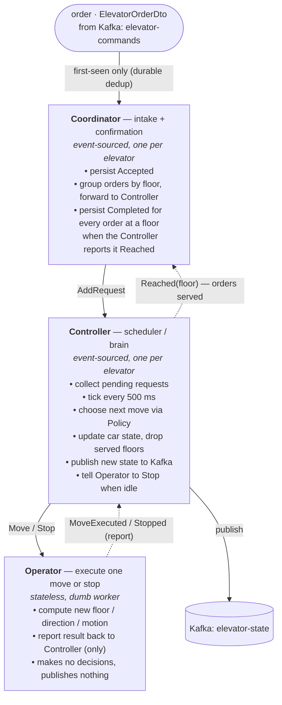
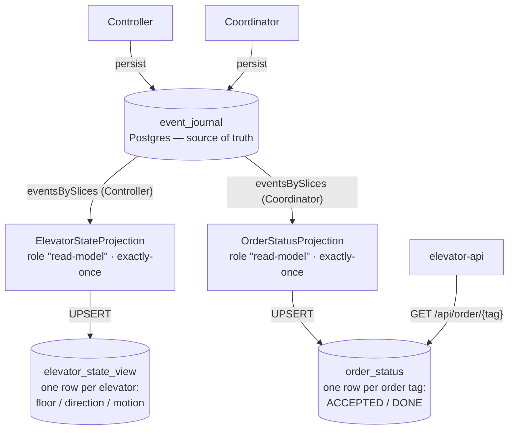

# Elevator System

An event-sourced elevator simulator, built as a hands-on lab for **modern distributed
programming** on (and off) the JVM:

- **Scala 3** — the pure domain (elevator, floors, scheduling policy)
- **Apache Pekko** — typed actors, cluster sharding, event sourcing + projections (the runtime)
- **PostgreSQL** (reactive **R2DBC**) — durable event journal + a CQRS read-model projection
- **Apache Kafka** — the command/state bus (log-centric architecture)
- **Spring Boot** (+ Actuator) — the HTTP edge and health probes
- **Rust** (ratatui) — a retro terminal console that speaks the same Kafka topics

It's grown in small, deliberate commits — read the history to follow the architecture
coming together.

## Architecture


Both the Spring API and the Rust console are independent clients of the same two Kafka
topics — the console talks straight to Kafka, the API adds HTTP on top.

### The actors — who does what

One order flows through three actors, each with a single responsibility. There is one
`Coordinator` and one `Controller` per elevator (cluster-sharded, event-sourced); the
`Operator` is a stateless worker.



| Actor | Responsibility | Tasks |
|-------|----------------|-------|
| **Coordinator** | Order intake **and** confirmation (event-sourced, per elevator) | Persist an `Accepted` event (idempotent — a re-delivered tag already outstanding records nothing); group orders by floor and forward each new one to the Controller as `AddRequest`; when the Controller reports a floor `Reached`, persist a `Completed` event for **every** order waiting at that floor. (Duplicate orders are dropped at the Kafka ingress — `OrderConsumer` + `OrderDedup`, durable via the `processed_orders` table. See **Crash recovery** below for why the tag is claimed only *after* this accept.) |
| **Controller** | The per-elevator scheduler / brain (event-sourced, per elevator) | Accumulate pending requests; on a 500 ms `Tick` pick the next move via the pure `Policy`; mark itself "waiting" until the move completes; **own publishing the car's `ElevatorState` to Kafka `elevator-state`**; drop a request once its floor is reached and **tell the Coordinator (`Reached(floor)`)** to confirm every order waiting there; when no requests remain, **tell the Operator to `Stop`** the car |
| **Operator** | Dumb worker — execute one physical move or stop (stateless) | Compute the new floor/direction/motion from the `Policy` command, or stop the car; report `MoveExecuted` / `Stopped` back to the Controller (its only collaborator). Makes no decisions and publishes nothing |
| **ElevatorStateProjection** | Read-side CQRS view (see below) | Replay Controller events by slice; UPSERT one row per elevator into `elevator_state_view` |
| **OrderStatusProjection** | Read-side CQRS view, keyed by order tag | Replay Coordinator events by slice; mark each order `PROGRESS` then `DONE` in `order_status` (powers `GET /api/order/{tag}`) |

### Persistence & read side (CQRS)

The `Controller` and `Coordinator` are event-sourced into a durable **R2DBC Postgres journal**
(state survives restarts, rebuilt by replaying events). Two **Pekko Projections** read those events
back out by slice and maintain queryable read-models — write side and read side are different
concerns, different tables:



Kafka (the `elevator-state` topic) stays as the **live, ephemeral** broadcast for the API cache
and console; the projections are the **durable, queryable** views derived from the journal.
`OrderStatusProjection` follows the `Coordinator`'s `Accepted`/`Completed` events so the API can
answer **"was the order with tag X processed?"** via `GET /api/order/{tag}`.

### Crash recovery (at-least-once, idempotent)

Event sourcing rebuilds actor state from the journal after a crash — but two handoffs cross
out of the journal (to the ephemeral `Operator`, and to the dedup table), so recovery needs
care to avoid a frozen car or a lost order:

- **Controller — re-dispatch the in-flight move.** The `waiting` latch is persisted, but the
  `Move`/`Stop` it waits on goes to the stateless `Operator`. A crash before the Operator
  reports back would replay `waiting=true` with the command gone, freezing the car forever.
  On `RecoveryCompleted` the Controller re-sends that command; the latch stays set, so no
  duplicate is issued and the Operator's report clears it as usual.
- **Ingress dedup — claim *after* accept, never before.** `OrderConsumer` **checks**
  `processed_orders` up front to drop re-sent tags, but **claims** the tag only *after* the
  `Coordinator` durably accepts. Claiming first would lose orders: a crash between the claim
  and the accept leaves the Kafka offset uncommitted, so the message is redelivered — and the
  already-claimed tag would be dropped, accepted by nobody. Claiming last means a crash there
  simply reprocesses the order; the Coordinator's idempotent accept covers that redelivery.

### Live vs durable: which source to read?

Two read paths, two jobs — pick by what the consumer needs:

| Consumer need | Read from | Why |
|---|---|---|
| **Online/real-time monitor** (ticking dashboard, console) | **Kafka** `elevator-state` | push-based, sub-second; ephemeral is fine for "now" |
| **Durable query / snapshot / history** (REST, survives restart) | **projection** `elevator_state_view` | complete & correct even right after a restart; queryable with SQL |
| **"Was order X processed?"** (by tag) | **projection** `order_status` via `GET /api/order/{tag}` | per-order lifecycle (PROGRESS → DONE), durable and indexed by tag |

Best of both for a live UI: **seed** the initial picture once from `elevator_state_view` (so nothing
is blank at startup), then **stream** live updates from the Kafka topic.

| Module                 | Stack   | Role                                                                 |
|------------------------|---------|---------------------------------------------------------------------|
| `elevator-common-core` | Scala 3 | Pure domain: elevator, floors, scheduling `Policy`                   |
| `elevator-common-dto`  | Scala 3 | Messages shared across the wire                                     |
| `elevator-app`         | Pekko   | The brain: event-sourced `Coordinator` / `Controller` / `Operator` + R2DBC journal & read-side projection |
| `elevator-api`         | Spring  | HTTP edge + Actuator health (Kafka readiness check)                 |
| `elevator-console`     | Rust    | Tabbed terminal UI: chart, floor-over-time, single order, bulk `sim` (progress bar), actuator health, log viewer |

## Run

```bash
scripts/demo-up.sh            # infra + both JVMs, seeds a fleet (e1..eN), opens the chart
                              #   PROFILE=test|prod | ELEVATORS=N | FLEET_FILE=scripts/fleet.txt | SEED=N | NO_UI=1
# or run the rich console yourself:
cd elevator-console && cargo run -- monitor      # Tab: chart / trend / order / sim / health / logs
scripts/demo-down.sh          # stop everything

# inspect the durable read-model:
docker exec -i elevator-demo-postgres psql -U elevator -d elevator -c \
  "SELECT * FROM elevator_state_view;"
```

See **[demo.md](demo.md)** for the scripted demo and endpoints, and
**[elevator-console/README.md](elevator-console/README.md)** for the console.

## Build

Maven multi-module, Java 21. `mvn package` builds the JVM modules (a `maven-enforcer`
rule guards dependency convergence). The Rust console is a separate `cargo` build,
wired in behind `-Pconsole` / `-Dcargo.skip=false` — see the console README.

## Testing

Beyond the JVM unit/IT tests (`mvn test` / `mvn verify`), the **console is the integration
harness** — it talks to the running system over Kafka + HTTP, so it tests the whole loop:

```bash
# headless console self-checks (no TUI; safe in any shell):
elevator-console selftest          # api health UP + Kafka consuming -> PASS/FAIL + exit code
elevator-console watch             # live state stream to stdout

# big integration test: send N tagged orders, poll the api per order until DONE, then
# CROSS-CHECK the run against the elevator-app + elevator-api pod logs, and report
# requests / latency / loss. One self-contained Rust binary — no Python/Go.
KAFKA_BOOTSTRAP=localhost:9094 elevator-console itest --count 20 --timeout 90
#   -> logs/itest-report.{json,md}; exit 0 only if 0 lost, api confirms every tag DONE,
#      the app actually moved, and there's no "Kafka stream failed".
```

**Commit gate.** A pre-commit hook runs the integration test and **blocks the commit if it
fails**. Enable it once per clone:

```bash
git config core.hooksPath scripts/hooks
```

It skips (rather than blocks every commit) when the kind cluster is unreachable, or with
`SKIP_ITEST=1 git commit …`.

### Order validation (api)

`POST /api/order` is validated with Jakarta Bean Validation against config params
`elevator.max-floor` (15) and `elevator.elevators` (e1..e10) — a bad floor or unknown
elevator returns **400** with the offending field. Tune via env `ELEVATOR_MAXFLOOR` /
`ELEVATOR_ELEVATORS` (the api ConfigMap).

### Fast / slow mode (k8s)

The app runs `FastOperator` or `SlowOperator`, chosen by which ConfigMap the deployment's
`envFrom` points at — `elevator-app-config-fast` or `elevator-app-config-slow`. Flip it from
the console's **K8s tab** (`f` / `s`), which swaps the ConfigMap + rolls the pod via `kubectl`.

## Why this project exists

A sandbox for the patterns behind resilient distributed systems — the actor model,
event sourcing / CQRS, log-centric messaging, idempotency, backpressure, and
observability — small enough to read in an afternoon, real enough to break on purpose
and learn from.

## Roadmap

**Done:** durable **R2DBC Postgres journal** (state survives restarts) + a **Pekko Projection**
maintaining the `elevator_state_view` read-model, with recovery & schema-evolution tests
(`mvn -pl elevator-app test`).

Next: point the API's read path at the projection (a reactive `GET /elevators` over
`elevator_state_view`) instead of the in-memory Kafka cache, so HTTP queries are durable and
restart-safe. Further out: a multi-node cluster (the projection is already role-gated to
`read-model` nodes), a separate read database, CRDTs (`distributed-data`), and
chaos/fault-injection drills.
