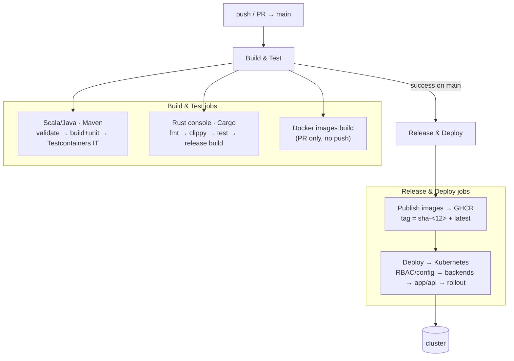

# CI / CD

Two GitHub Actions workflows tailored to this polyglot, event-sourced system:

| Workflow | File | Trigger | Does |
|----------|------|---------|------|
| **Build & Test** | `.github/workflows/ci.yml` | push + PR to `main` | compile + test the Maven reactor and the Rust console; build images on PRs |
| **Release & Deploy** | `.github/workflows/cd.yml` | after Build & Test passes on `main` (or manual) | push images to GHCR, roll them onto the cluster |

Build & Test always runs and **gates** Release & Deploy — a red build never ships.



---

## Build & Test (`ci.yml`)

Runs on every push and PR to `main`. No setup — works today. Three jobs:

### `jvm` — Scala/Java · Maven
Temurin 21 with Maven cache, then staged for clear signal (you see *which* stage
broke, not just "verify failed"):

1. **Validate reactor & dependency convergence** — `./mvnw validate` runs the
   enforcer `requireUpperBoundDeps` rule across all 12 modules.
2. **Build & unit tests** — `./mvnw install -DskipITs` compiles Scala 3
   (`elevator-common-*`) + `elevator-app` + `elevator-api` and runs the surefire
   unit tests (logic, strategy, event evolution, actor recovery, serialization).
   Integration tests are skipped here.
3. **Integration tests (Testcontainers)** — `./mvnw verify -Dsurefire.skip=true`
   runs only the failsafe `ElevatorStateFlowIT`, which boots Spring and spins up
   Postgres + Kafka in Docker. `ubuntu-latest` provides the Docker daemon, so this
   needs no extra setup.
4. Test reports (`*-reports/*.xml`) are uploaded as an artifact.

### `rust` — Rust console · Cargo
Installs `librdkafka-dev` (rdkafka links it), then `cargo fmt --check`,
`cargo clippy -D warnings`, `cargo test`, and a `--release` build (the demo and
the pre-commit itest run the release binary). The Maven build never compiles the
console — it is behind the `-Pconsole` profile — so **CI is the only gate** for
the Rust code.

> `fmt --check` and `clippy -D warnings` are strict. Formatting drift or warnings
> fail the job until a one-time `cargo fmt` / clippy cleanup. That is the gate
> working, not a pipeline bug.

### `images` — Docker images build (PR only)
On pull requests, builds both `elevator-app` and `elevator-api` images with
`push: false` (matrix, buildx + GHA cache) to catch Dockerfile regressions before
merge. On `main`, publishing is Release & Deploy's job instead. The Dockerfiles
build with `-DskipTests` because the same commit's tests already ran in `jvm`.

---

## Release & Deploy (`cd.yml`)

Triggers via `workflow_run` **after Build & Test succeeds on `main`** (or manually
from the Actions tab). Two jobs.

### `publish` — Publish images → GHCR
Builds both images and pushes them to **GHCR** (`ghcr.io/<owner>/elevator-app`
and `-api`), tagged with the commit SHA (`sha-<12>`) and `latest`. Uses the
built-in `GITHUB_TOKEN` — **no secret to configure.** Works the moment the file
is on `main`.

### `deploy` — Deploy → Kubernetes (Pekko cluster)
Applies manifests in the order the cluster actually needs, then pins the image to
this commit and waits for the rollout:

1. **RBAC, config & DB schema** — `rbac.yaml` (Pekko bootstrap lists sibling pods
   via the k8s API), `configmap.yaml` (fast/slow mode + Kafka wiring),
   `postgres-init.yaml` (the DDL ConfigMap the StatefulSet mounts).
2. **Stateful backends** — `postgres.yaml` + `kafka.yaml`, then
   `kubectl rollout status` on both. The event journal and Kafka must be reachable
   before the app cluster forms and starts consuming.
3. **App & API** — apply, then `kubectl set image ...:sha-<12>` so the running
   pods use the image built from this exact commit.
4. **Wait for rollout** — generous timeout because the rolling update is
   `maxUnavailable: 0` and the app's startup probe tolerates cluster-formation +
   journal-recovery time.

### What you must provide to enable the deploy

The deploy job runs in GitHub's cloud and **cannot reach a kind cluster on your
laptop.** To go live you need a reachable cluster (managed k8s, or your own with
a public API endpoint) and:

1. **Create a `production` environment** — Settings → Environments → New
   environment → `production`. Optionally add a **required reviewer** so each
   deploy waits for a one-click approval.
2. **Add the `KUBECONFIG` secret** to that environment, base64-encoded:
   ```bash
   cat ~/.kube/config | base64 -w0
   ```

Until the secret exists, `publish` still runs and updates GHCR; only the `deploy`
job fails (at "Configure kubectl" — `current-context is not set`).

### Private images (optional)

The GHCR packages are currently **public** (repository-scoped packages inherit
the public repo's visibility), so no pull secret is needed. If you make them
**private**, add a `GHCR_PULL_TOKEN` environment secret — a classic PAT with
`read:packages` (not the short-lived `GITHUB_TOKEN`, which expires when the run
ends). CD then creates a `ghcr-pull` docker-registry secret, which both
deployments already reference via `imagePullSecrets`. When `GHCR_PULL_TOKEN` is
unset that step is skipped and the missing secret is harmless for public images.

---

## Why the manifests still say `image: …:local`

`k8s/app.yaml` / `k8s/api.yaml` keep `image: elevator-app:local` so the local
**kind** demo (which `kind load`s the `:local` images) keeps working. CD does not
edit the files — it overrides the image at deploy time with `kubectl set image`
to the exact GHCR SHA. Local dev and cloud deploy never fight over the manifest.

## Known follow-ups

- **Terraform drift** — `terraform/` diverges from `k8s/` (1 vs 2 replicas,
  missing StatefulSet/RBAC/probes). `k8s/` is authoritative and is what CD
  applies; the terraform path is not wired into CD.
- **Secrets** — the Postgres password is still in a ConfigMap; move it to a
  `Secret` before any real deploy.
