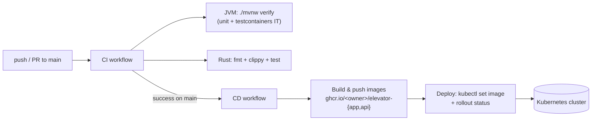

# CI / CD

Two GitHub Actions workflows. **CI** always runs and gates everything; **CD**
only runs after CI is green on `main`.



## CI — `.github/workflows/ci.yml`

Runs on every push and PR to `main`. No setup needed; works today.

- **JVM job** — Temurin 21, Maven cache, `./mvnw -B -ntp verify`. This runs the
  unit tests (surefire) **and** the integration test (failsafe +
  testcontainers, `ElevatorStateFlowIT`). GitHub's `ubuntu-latest` runner has a
  Docker daemon, so testcontainers just works.
- **Rust job** — installs `librdkafka-dev` (rdkafka links it), then
  `cargo fmt --check`, `cargo clippy -D warnings`, `cargo test` for
  `elevator-console`. The Maven build never compiles the console (it is behind
  the `-Pconsole` profile), so CI is the only place the Rust code is checked.

> First-run note: `fmt --check` and `clippy -D warnings` are strict. If the
> existing console code has formatting drift or warnings, this job will go red
> until a one-time `cargo fmt` / clippy cleanup. That is CI doing its job, not a
> bug in the pipeline.

## CD — `.github/workflows/cd.yml`

Triggers via `workflow_run` **after CI completes successfully on `main`** (or
manually from the Actions tab). Two jobs:

1. **images** — builds both Docker images and pushes them to **GHCR**
   (`ghcr.io/<owner>/elevator-app` and `-api`), tagged with both the commit SHA
   (`sha-<12>`) and `latest`. Uses the built-in `GITHUB_TOKEN` — **no secret to
   configure.** This half works the moment the file is on `main`.
2. **deploy** — configures `kubectl` from a secret and rolls the new SHA-pinned
   images onto the cluster (`kubectl set image` + `rollout status`).

### What you must provide to enable the deploy

The deploy job cannot reach a kind cluster on your laptop — Actions runs in
GitHub's cloud. To make it live you need a **reachable** cluster (managed k8s,
or your own with a public API endpoint) and:

1. **Create a `production` environment** — repo → Settings → Environments → New
   environment → `production`. Optionally add yourself as a **required
   reviewer** so every deploy waits for a one-click approval.
2. **Add the `KUBECONFIG` secret** to that environment — base64-encode your
   kubeconfig and paste it:
   ```bash
   cat ~/.kube/config | base64 -w0
   ```
3. **Make the GHCR images pullable by the cluster.** Either mark the two GHCR
   packages **public** (repo → Packages → package → visibility), or create an
   `imagePullSecret` in the cluster and reference it from the deployments.

Until step 2 exists the deploy job fails at "Configure kubectl" — the
image-build/push half still runs and publishes to GHCR.

## Why not deploy straight from the manifests' image field?

`k8s/app.yaml` / `k8s/api.yaml` keep `image: elevator-app:local` on purpose —
the local **kind** demo loads those `:local` images. CD leaves the files alone
and overrides the image at deploy time with `kubectl set image` to the exact
GHCR SHA, so local dev and cloud deploy don't fight over the manifest.

## Known follow-ups

- **Terraform drift** — `terraform/` diverges from `k8s/` (1 vs 2 replicas,
  missing StatefulSet/RBAC/probes). Pick one source of truth; today `k8s/` is
  authoritative and CD applies it. The terraform path is not wired into CD.
- **Secrets** — the Postgres password is still hardcoded in a ConfigMap; move it
  to a `Secret` before any real deploy.
