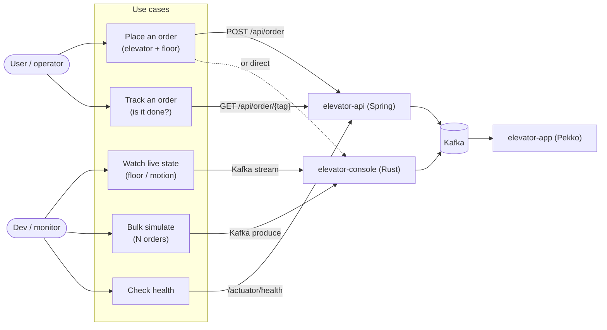
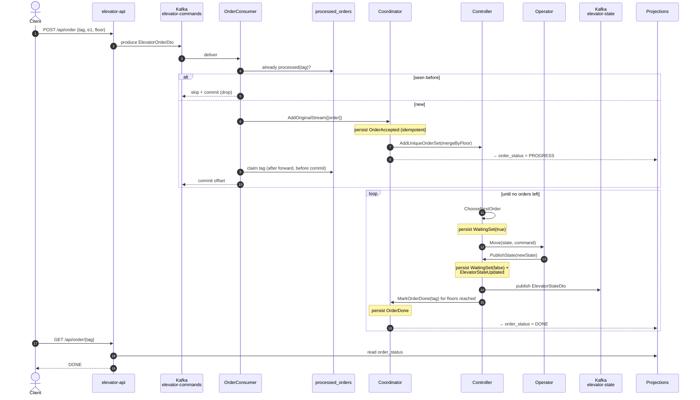
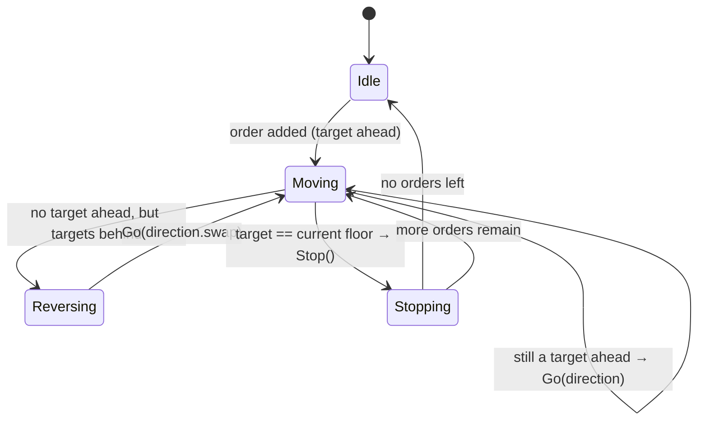
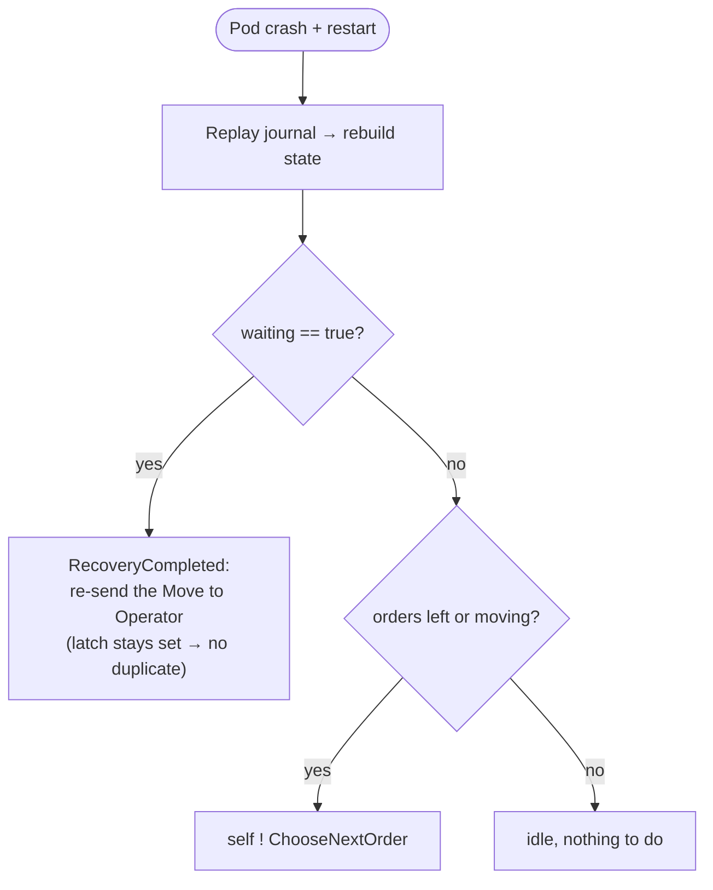
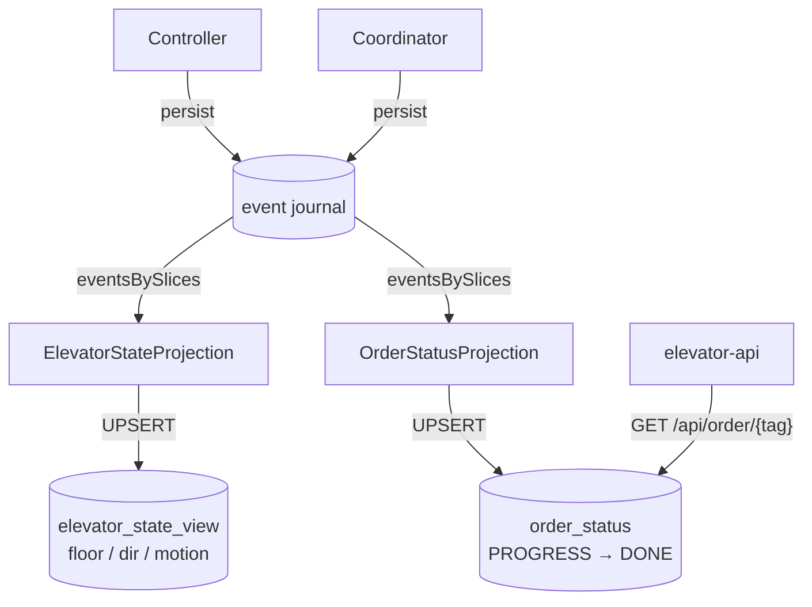

# Elevator System — Protocol

How an order travels through the system, the messages each actor speaks, and the
rules that keep it correct after a crash.

This is the **true source** for message names. The picture in the top-level
[README](../README.md) is simplified for a first read — the names below are the
ones in the code.

- Domain & logic (Pekko-free, unit-tested): `elevator-common-*`
- Actors (thin shells over the logic): `elevator-app/.../actors/`
- Edges: `elevator-api` (Spring HTTP), `elevator-console` (Rust)

---

## 1. Components & use cases

Who talks to the system, and what they ask it to do.



Two clients, same two Kafka topics. The API adds HTTP + durable queries on top;
the console speaks Kafka directly for live view and bulk load.

---

## 2. The three actors

One order flows through three actors. Each has **one** job. There is one
`Coordinator` and one `Controller` **per elevator** (cluster-sharded,
event-sourced); the `Operator` is a stateless worker.

| Actor | Job | Event-sourced? |
|-------|-----|----------------|
| **Coordinator** | Intake + confirm. Accept orders, group by floor, hand to Controller; mark each order done when its floor is reached. | yes |
| **Controller** | The brain. Hold pending orders, pick the next move, own publishing state to Kafka, tell the Coordinator which orders are served. | yes |
| **Operator** | The muscle. Run one move on the car, report the new state back. Decides nothing, publishes nothing. | no (stateless) |

---

## 3. Message catalog

These are the exact `sealed trait` commands and persisted events.

### Commands (in-memory, actor → actor)

```scala
// CoordinatorProtocol
AddOriginalStream(orders: List[ElevatorOrderDto])   // raw orders from Kafka
MarkOrderDone(tag: String)                          // Controller: floor reached

// ControllerProtocol
AddUniqueOrderSet(orders: Set[ElevatorOrder])       // from Coordinator, merged by floor
ChooseNextOrder(orders: Set[ElevatorOrder])         // self-message: decide next move
PublishState(state: ElevatorState)                  // from Operator: move finished

// OperatorProtocol
Move(elevatorName: String, state: ElevatorState, command: ElevatorCommand)
```

### Events (persisted to the Postgres journal)

```scala
// CoordinatorEvents
OrderAccepted(tag: String, elevatorName: String, floor: Int)
OrderDone(tag: String)

// ControllerEvents
OrderAdded(order: ElevatorOrder)
WaitingSet(waiting: Boolean)          // latch: a move is in flight
ElevatorStateUpdated(state: ElevatorState)
```

### Wire DTOs (JSON over Kafka)

```scala
ElevatorOrderDto(tag, elevatorName, floor)                     // topic: elevator-commands
ElevatorStateDto(tag, elevatorName, direction, motion, floor)  // topic: elevator-state
```

### Kafka topics

| Topic | Direction | Carries | Produced by | Consumed by |
|-------|-----------|---------|-------------|-------------|
| `elevator-commands` | into app | `ElevatorOrderDto` | API, console | `OrderConsumer` |
| `elevator-state` | out of app | `ElevatorStateDto` | Controller (via `StatePublisher`) | API cache, console |

---

## 4. End-to-end sequence

The full life of one order: HTTP in, car moves, status queryable.



Key points:
- The Controller **drives its own loop** by self-sending `ChooseNextOrder` after
  every move. There is no external timer; pacing comes from the engine
  (`SlowEngine` burns CPU per step, `FastEngine` is near-instant).
- `served = orders where floor == newState.floor` — when the car reaches a floor,
  every order waiting there is marked done in one go.

---

## 5. Scheduling — how the next move is chosen

Pure function `NextFloorStrategy.default` (a simple **SCAN**): keep going the same
way while there is a target ahead, otherwise reverse, otherwise stop.



In code:

```scala
if targets.contains(current) then Stop()          // arrived → stop, serve floor
else if targetAhead(current, dir, targets) then Go(dir)
else if targets.nonEmpty then Go(dir.swap)        // turn around
else Stop()                                        // nothing to do
```

---

## 6. Two dedups — do not confuse them

They solve different problems at different layers.

| | **Ingress dedup** | **Same-floor coalescing** |
|---|---|---|
| Where | `OrderConsumer` + `processed_orders` table | `Controller` (`ControllerLogic.evolve`) |
| Keyed by | order **tag** | **floor** |
| Purpose | drop a Kafka message redelivered after a crash | one car stop serves every order waiting at that floor |
| How | `alreadyProcessed(tag)` → skip; else forward + `markProcessed(tag)` | targets are a `Set[Floor]`; on arrival `evolve` drops **all** orders with `floor == reached`, and each of their tags gets a `MarkOrderDone` |

So: every distinct order is recorded (audit + per-tag status), but two orders for
the same floor cost only **one stop** — and both are marked done together.

> Note: `CoordinatorLogic.mergeByFloor` also collapses by floor and is unit-tested,
> but on the live path it is a **no-op** — `OrderConsumer` sends one order per Kafka
> message (`AddOriginalStream(List(dto))`), so its input is always a single element.
> The coalescing that actually matters at runtime is the Controller's.

---

## 7. Crash recovery

State is rebuilt by replaying the journal. Two handoffs leave the journal — to the
stateless Operator, and to the dedup table — so each needs a guard.



- **Controller — re-dispatch the in-flight move.** `WaitingSet(true)` is durable
  but the `Move` it waits on went to the stateless Operator. A crash before the
  Operator reports back would replay `waiting=true` with the command gone — a
  frozen car. On `RecoveryCompleted` the Controller re-sends the command; the
  latch is still set, so no duplicate, and the Operator's report clears it.

- **Ingress — claim _after_ forwarding, never before.** `OrderConsumer` **checks**
  `processed_orders` up front to drop re-sent tags, then forwards the order to the
  Coordinator and only **then** `markProcessed(tag)` — and the Kafka offset is
  committed only after that claim. (The forward is a fire-and-forget `!`, so the
  claim follows the *hand-off* to the Coordinator, not its durable persist.)
  Claiming first would lose orders: a crash between claim and offset-commit leaves
  the message to be redelivered, and the already-claimed tag would be dropped —
  accepted by nobody. Claiming last means a crash there simply reprocesses the
  order; the Coordinator's idempotent accept covers the redelivery.

---

## 8. Read side (CQRS)

The journal is the source of truth (write side). Two Pekko projections replay it
into queryable tables (read side). Kafka `elevator-state` stays as the **live,
ephemeral** feed.



| Need | Read from | Why |
|------|-----------|-----|
| Live dashboard | Kafka `elevator-state` | push, sub-second, "now" only |
| Durable snapshot | `elevator_state_view` | correct right after restart, SQL-queryable |
| "Was order X done?" | `order_status` | per-tag lifecycle, durable, indexed |

---

## Source map

| Thing | File |
|-------|------|
| Coordinator actor | `elevator-app/.../actors/Coordinator.scala` |
| Controller actor | `elevator-app/.../actors/Controller.scala` |
| Operator actor | `elevator-app/.../actors/Operator.scala` |
| Commands | `elevator-common-protocol/.../{Coordinator,Controller,Operator}Protocol.scala` |
| Events | `elevator-common-events/.../{Coordinator,Controller}Events.scala` |
| Controller logic (decide/evolve) | `elevator-common-logic/.../ControllerLogic.scala` |
| Coordinator logic (merge) | `elevator-common-logic/.../CoordinatorLogic.scala` |
| Scheduling | `elevator-common-strategy/.../NextFloorStrategy.scala` |
| Core domain | `elevator-common-core/.../{Elevator,ElevatorOrder}.scala` |
| Ingress dedup | `elevator-app/.../inbound/{OrderConsumer,OrderDedup}.scala` |
| Projections | `elevator-app/.../readside/{ElevatorState,OrderStatus}Projection.scala` |
