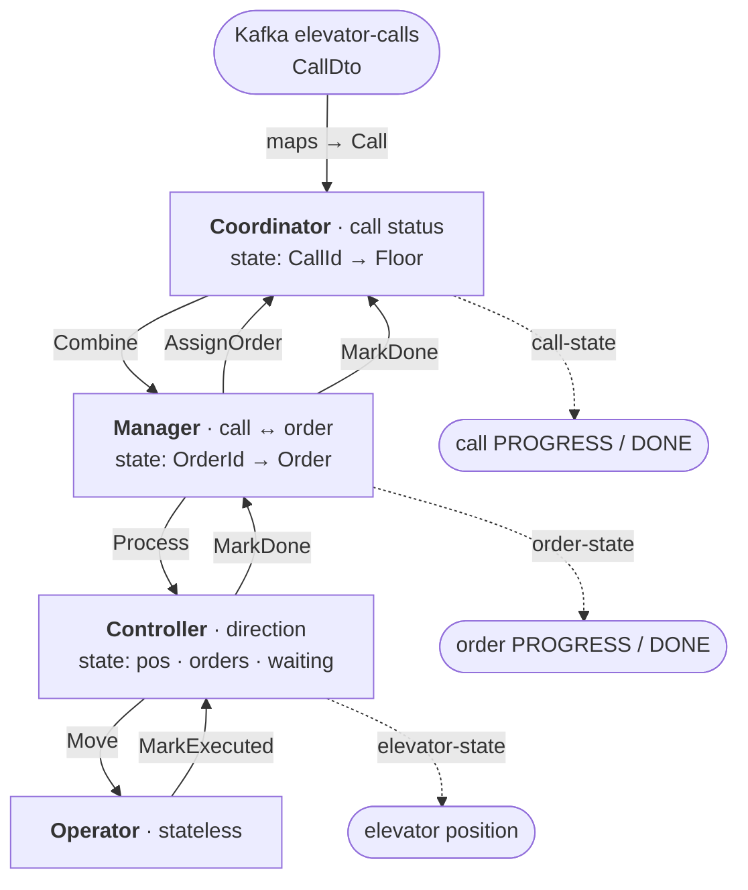

# Actor Contract

Four actors, one per elevator. `[cmd]` in · `[evt]` stored · `[pub]` to Kafka. Three are
**event-sourced** (state = the fold of their events); the **Operator** is **stateless**.

## The message map

## Per actor

**Coordinator** · state `Map[CallId, Floor]`
- `[cmd] Handle(List[Call])` → `[evt] CallReceived` · `[pub]` call = PROGRESS · → `Manager.Combine`
- `[cmd] AssignOrder(CallId, OrderId)` → `[evt] CallAssigned`
- `[cmd] MarkDone(CallId)` → `[evt] CallDone` · `[pub]` call = DONE

**Manager** · state `Map[OrderId, Order]`
- `[cmd] Combine(List[Call])` → `[evt] OrderCreated | OrderExtended` · `[pub]` order = PROGRESS · → `Coordinator.AssignOrder`, `Controller.Process`
- `[cmd] MarkDone(OrderId)` → `[evt] OrderDone` · `[pub]` order = DONE · → `Coordinator.MarkDone`

**Controller** · state `waiting · ElevatorState · Set[Order]`
- `[cmd] Process(Set[Order])` → `[evt] OrderAccepted` · → self `ChooseNext`
- `[cmd] ChooseNext(Set[Order])` → `[evt] WaitingSet(true)` · → `Operator.Move`
- `[cmd] MarkExecuted(ElevatorState)` → `[evt] WaitingSet(false), ElevatorStateUpdated` · `[pub]` elevator · → `Manager.MarkDone` (reached floor)

**Operator** · stateless
- `[cmd] Move(ElevatorName, ElevatorState, Command)` → no event · → `Controller.MarkExecuted`

## The odd bits, explained

- **No DTOs inside actors** — the `CallConsumer` maps `CallDto → Call` at the edge; actors speak only
  domain types.
- **`ChooseNext` + `WaitingSet`** turn the move loop into messages, so a crash mid-move re-issues the
  move on recovery. A blocking loop cannot.
- **Serving is floor-based** — reaching a floor closes every order there (and every call under them).

Flow over time: [actors.md](actors.md) · full sequence & topics: [protocol.md](protocol.md).
