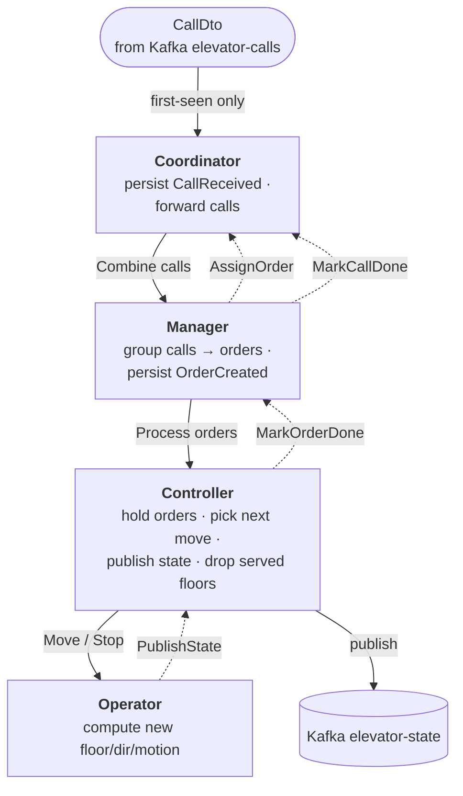

# The four actors

A **Call** is one user action (press a button: `id, elevatorName, floor`). The app groups
calls that share a floor into an immutable **Order** (`order id = hash(sorted call ids)`), a
single stop. Four actors, one per elevator; the first three are cluster-sharded and
event-sourced, the **Operator** is a stateless worker.

| Actor | Owns | Job | Event-sourced |
|---|---|---|---|
| **Coordinator** | call status | Persist `CallReceived`, forward calls to the Manager, record `CallAssigned` / `CallDone`. | yes |
| **Manager** | call ↔ order relation | Group calls into orders (`GroupCallsStrategy`), persist `OrderCreated`, tell the Coordinator each call's order, hand orders to the Controller; on done persist `OrderDone` + tell the Coordinator each call is done. | yes |
| **Controller** | movement | Pick the next stop (`NextFloorStrategy`), tell the Operator to `Move`, publish state, mark reached orders done via the Manager. | yes |
| **Operator** | nothing | Run one move on the car, report the new state. Decides nothing. | no |

## Flow

- The Controller **drives its own loop**: after each move it self-sends `ChooseNext`.
  Pacing comes from the [engine](core.md), not a timer.
- On arrival, **every** order waiting at that floor is dropped in one go (same-floor
  coalescing) — the Manager then marks it done, closing every call under it.

Exact messages and events: [protocol.md](protocol.md). Recovery guards: [crash-recovery.md](crash-recovery.md).
