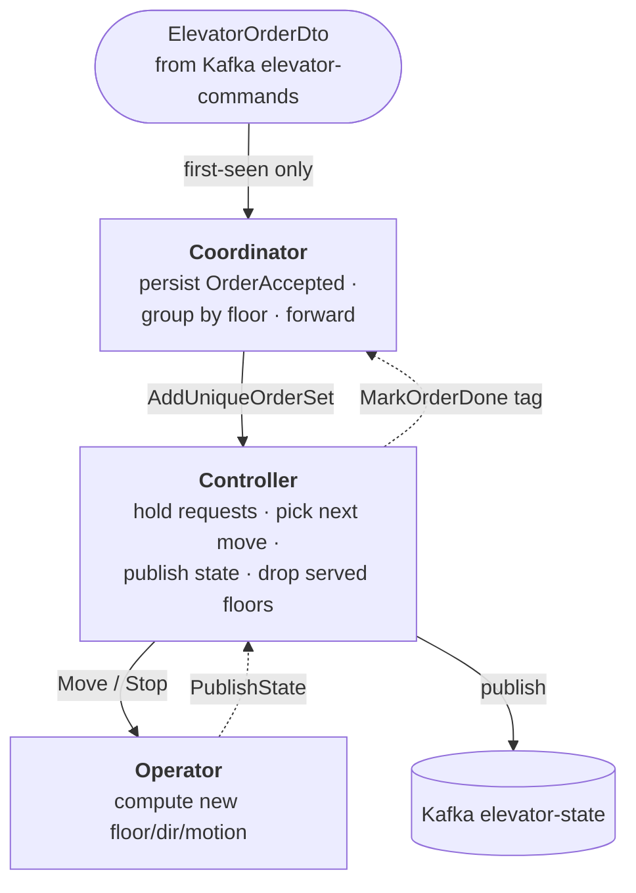

# The three actors

One order flows through three actors, each with a single job. There is one **Coordinator**
and one **Controller** per elevator (cluster-sharded, event-sourced); the **Operator** is a
stateless worker.

| Actor | Job | Event-sourced |
|---|---|---|
| **Coordinator** | Intake + confirm. Accept orders, group by floor, hand to Controller; mark each order done when its floor is reached. | yes |
| **Controller** | The brain. Hold pending orders, pick the next move, publish state to Kafka, tell the Coordinator which orders are served. | yes |
| **Operator** | The muscle. Run one move on the car, report the new state back. Decides nothing, publishes nothing. | no |

## Flow

- The Controller **drives its own loop**: after each move it self-sends `ChooseNextOrder`.
  Pacing comes from the [engine](core.md), not a timer.
- On arrival, **every** order waiting at that floor is marked done in one go
  (same-floor coalescing — see [protocol.md §dedup](protocol.md)).

Exact messages and events: [protocol.md](protocol.md). Recovery guards: [crash-recovery.md](crash-recovery.md).
