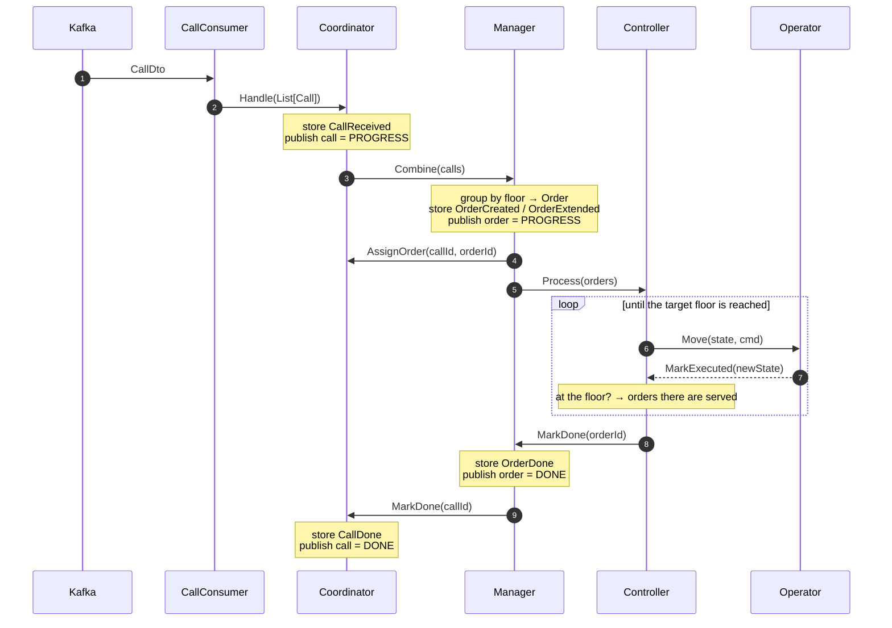
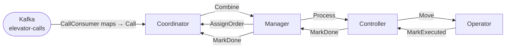

# The four actors

One elevator = **four actors**. Three **remember** (event-sourced); the **Operator** is a dumb worker.

| Actor | Remembers? | Owns |
|---|---|---|
| **Coordinator** | yes | call status |
| **Manager** | yes | call ↔ order |
| **Controller** | yes | direction (movement) |
| **Operator** | no | one move |

## One call, start to finish

## Who talks to whom

Two things to hold onto:

- The **Controller drives its own loop** — after each move it self-sends `ChooseNext`. The
  [engine](core.md) paces it (real travel time), not a timer.
- Serving is **floor-based** — reaching a floor closes *every* order waiting there at once, which
  closes every call under them.

Every message, event and type: [actor-contract.md](actor-contract.md). Recovery guards:
[crash-recovery.md](crash-recovery.md).
