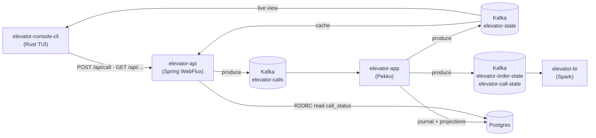

# Architecture

The system is a Scala/Pekko brain, a Spring HTTP edge, a Rust console, plus Kafka and
Postgres. Users submit **calls**; the app groups same-floor calls into **orders**
([actors](actors.md)).

## Modules

| Module | Stack | Role |
|---|---|---|
| `elevator-common-core` | Scala 3 | Pure domain + engine — see [core.md](core.md). |
| `elevator-common-dto` | Scala 3 | Wire DTOs shared across modules. |
| `elevator-sim` | Scala 3 | Load simulator engine: a fixed burst of random calls fired via a caller-supplied `CallSender`. Behind `POST /api/simulate`. |
| `elevator-app` | Pekko | The brain: event-sourced [actors](actors.md) + R2DBC journal + [read-side projections](read-model.md). |
| `elevator-api` | Spring WebFlux | HTTP edge + Actuator health. No actors. |
| `elevator-console-cli` | Rust (ratatui) | Terminal console: Chart + Trend + Sim tabs, call sender + simulate trigger. |
| `elevator-console-web` | Elm | Browser console (Chart + Trend + Sim tabs), a web sibling of the Rust console. |

Infra: **Kafka** (4 topics) and **Postgres** (event journal + read-model tables).

Both consoles are pure HTTP clients of `elevator-api` — neither touches Kafka.

## Data flow

## Kafka topics

| Topic | Producer | Consumer | Payload |
|---|---|---|---|
| `elevator-calls` | api | app (`CallConsumer`) | `CallDto{id, elevatorName, floor}` |
| `elevator-state` | app (`ElevatorStatePublisher`) | api cache, console, BI | `ElevatorStateDto{elevatorName, direction, motion, floor}` |
| `elevator-order-state` | app (`OrderStatePublisher`) | BI | `OrderStateDto{orderId, elevatorName, floor, status, callIds}` |
| `elevator-call-state` | app (`CallStatePublisher`) | BI | `CallStateDto{id, elevatorName, floor, status}` |

All keyed by `elevatorName`. Full message catalog: [protocol.md](protocol.md).

## Console ↔ system

The console reaches the system **only** through the HTTP API (calls via `POST /api/call`,
live state via SSE `GET /api/elevator/stream`) or infra (`kubectl`/`git`). It does **not**
touch Kafka.
