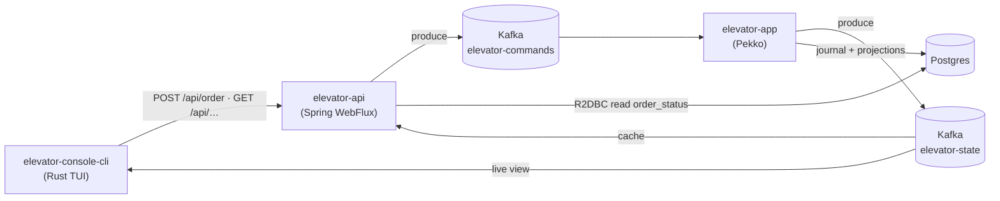

# Architecture

The system is five parts around two Kafka topics: a Scala/Pekko brain, a Spring HTTP
edge, a Rust console, plus Kafka and Postgres.

## Modules

| Module | Stack | Role |
|---|---|---|
| `elevator-common-core` | Scala 3 | Pure domain + engine — see [core.md](core.md). |
| `elevator-common-dto` | Scala 3 | Wire DTOs shared across modules. |
| `elevator-app` | Pekko | The brain: event-sourced [actors](actors.md) + R2DBC journal + [read-side projections](read-model.md). |
| `elevator-api` | Spring WebFlux | HTTP edge + Actuator health. No actors. |
| `elevator-console-cli` | Rust (ratatui) | Terminal dashboard + order sender. |
| `elevator-console-web` | Angular | Read-only browser monitor (Chart + Trend), a web sibling of the Rust console. |

Infra: **Kafka** (2 topics) and **Postgres** (event journal + read-model tables).

Both consoles are pure HTTP clients of `elevator-api` — neither touches Kafka.

## Data flow

## Kafka topics

| Topic | Producer | Consumer | Payload |
|---|---|---|---|
| `elevator-commands` | api | app (`OrderConsumer`) | `ElevatorOrderDto{tag, elevatorName, floor}` |
| `elevator-state` | app (`StatePublisher`) | api cache, console | `ElevatorStateDto{tag, elevatorName, direction, motion, floor}` |

Both keyed by `elevatorName`. Full message catalog: [protocol.md](protocol.md).

## Console ↔ system

The console reaches the system **only** through the HTTP API (orders via `POST /api/order`,
live state via SSE `GET /api/elevator/stream`) or infra (`kubectl`/`git`). It does **not**
touch Kafka.
