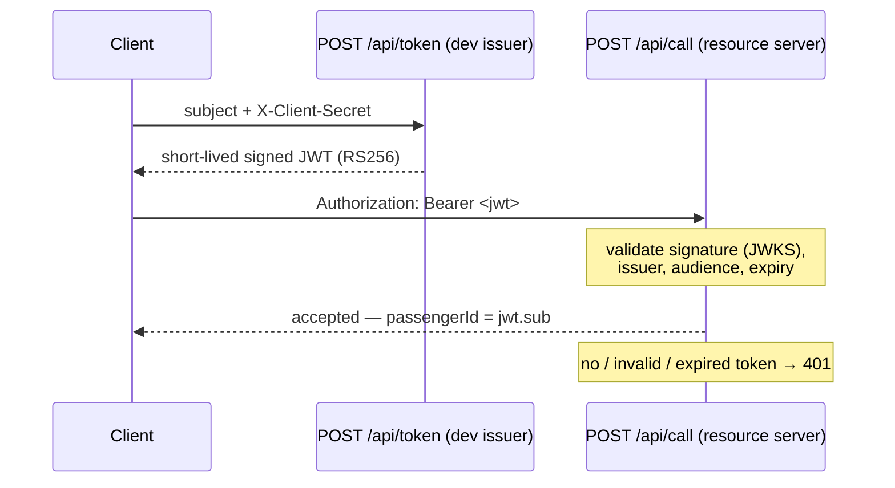

# Auth

Passenger identity is **proven, not claimed**. `POST /api/call` requires a valid **Bearer JWT**;
the passenger is the token's `sub`. A body `passengerId` is ignored. No token → **401**.

Enforcement lives **only in `elevator-api`** (the HTTP edge). The app / Kafka layer is untouched —
it still consumes `CallDto` with a `passengerId`, now always a proven subject.

## Flow



## Endpoints

| Endpoint | Purpose |
|---|---|
| `POST /api/token` | Dev issuer: mints a JWT for a `subject`. Gated by the `X-Client-Secret` header. |
| `GET /oauth2/jwks` | Publishes the public signing key (JWKS). |
| `POST /api/call` | Requires a valid Bearer JWT; `passengerId` = `sub`. |

Read endpoints (state streams, `/api/config`, `/api/version`, `/actuator/health`) stay open.

## The dev issuer

`POST /api/token` is a **stand-in for a real passenger login**, kept as small as possible: it signs
a short-lived token for whatever `subject` is asked, once the shared `X-Client-Secret` matches. It
is *not* a real IdP — it vouches for a claimed subject, it does not authenticate a human. Replacing
it with a real login (passkeys / OIDC) is future work.

## Config

| Key (`elevator.auth.*`) | Meaning | Default |
|---|---|---|
| `issuer` / `audience` | Validated on every token | `elevator-api` / `elevator` |
| `token-ttl-seconds` | Token lifetime | `300` |
| `client-secret` | Gate for `POST /api/token` (`ELEVATOR_CLIENT_SECRET`) | `dev-secret` (override in prod) |

## Where it lives

| Piece | File |
|---|---|
| Filter chain (`/api/call` → authenticated) | `elevator-api/.../auth/SecurityConfig.java` |
| Signing key + JWT decoder | `elevator-api/.../auth/JwtKeyConfig.java` |
| Token issuer (sign) | `elevator-api/.../auth/TokenService.java` |
| Token + JWKS endpoints | `elevator-api/.../auth/TokenController.java` |
| Reads `sub` → passenger | `elevator-api/.../call/CallController.java` |

> **Single-replica caveat.** The signing key is generated in-process, so multiple `api` replicas
> would reject each other's tokens. For a multi-replica cluster, mount a fixed key as a Secret.

```bash
# 1) get a token
JWT=$(curl -sk -X POST https://localhost:8080/api/token \
  -H 'content-type: application/json' -H 'X-Client-Secret: dev-secret' \
  -d '{"subject":"rider-0"}' | sed -E 's/.*"token":"([^"]+)".*/\1/')

# 2) place a call as that passenger
curl -sk -X POST https://localhost:8080/api/call \
  -H 'content-type: application/json' -H "Authorization: Bearer $JWT" \
  -d '{"elevatorName":"e1","floor":3}'

# no token → 401
curl -sk -o /dev/null -w '%{http_code}\n' -X POST https://localhost:8080/api/call \
  -H 'content-type: application/json' -d '{"elevatorName":"e1","floor":3}'
```

## Next steps

- **Console / CLI**: fetch a token per rider and send it as Bearer (drives the 100-rider sim).
- **Right to erasure**: pseudonymous subjects + crypto-shredding for the event journal.
