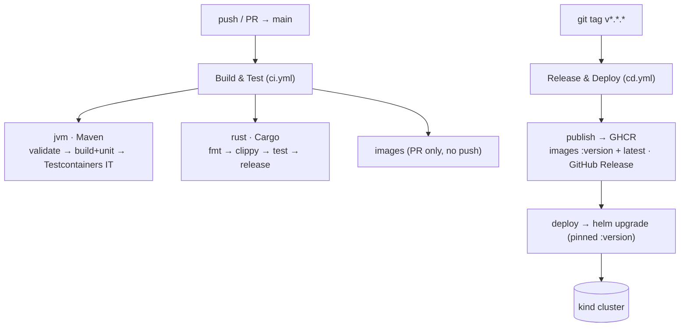

# CI / CD

Two GitHub Actions workflows. **Build & Test** gates **Release & Deploy** — a red build never
ships.



## Build & Test — `ci.yml` (push + PR to `main`)

- **jvm** (Temurin 21, staged for clear signal): `mvnw validate` (enforcer
  `requireUpperBoundDeps` across all modules) → `mvnw install -DskipITs` (compile + surefire
  unit tests) → `mvnw verify -Dsurefire.skip=true` (only failsafe `ElevatorStateFlowIT`, boots
  Spring + Postgres + Kafka via Testcontainers). Reports uploaded as an artifact.
- **rust**: installs `librdkafka-dev`, then `cargo fmt --check`, `clippy -D warnings`, `test`,
  `--release`. The Maven build never compiles the console (`-Pconsole` profile), so **CI is the
  only gate** for Rust. `fmt`/`clippy` are strict — drift fails the job (working as intended).
- **images** (PR only): builds both images `push: false` to catch Dockerfile regressions.

## Release & Deploy — `cd.yml` (**tag-only**: a `v*.*.*` version tag, or manual dispatch)

**Tag-driven.** A push to `main` runs only Build & Test — it does **not** deploy, so the cluster
always reflects the last *released* version. Cut a release with `git tag v1.0.0 && git push origin v1.0.0`.

- **publish**: on a `v*` tag, builds + pushes `ghcr.io/<owner>/elevator-{app,api,console-web,bi}`
  tagged with the **version** (`1.0.0`) + `latest`, and creates a **GitHub Release** (the tag must
  equal the `VERSION` file). Built-in `GITHUB_TOKEN` — no secret to configure. (A manual
  `workflow_dispatch` publishes a `sha-<12>` tag instead.)
- **deploy** (`runs-on: self-hosted`): `helm upgrade --install elevator charts/elevator` with the
  images pinned to the version (`--set global.images.*=…:1.0.0`), `--wait` until every rollout is
  Ready (the app's generous startup probe tolerates Helm's apply order — it retries until
  Postgres/Kafka are up). BI + one-shot seeding stay off in CD. The cluster + Calico + the
  `elevator-api-tls` / `ghcr-pull` secrets are provisioned once by `terraform apply`
  ([cluster.md](cluster.md)), not by CD.

## Self-hosted runner (why + recreate)

The cluster is a local **kind** (`https://127.0.0.1:<port>`) that cloud runners can't reach, so
`deploy` runs on a self-hosted runner **on the kind host**; `publish` stays on cloud runners.

Already set up: `dev` environment · `KUBECONFIG` secret (base64 of the minified kubeconfig,
decoded to a job-local temp file, never touches `~/.kube/config`) · runner `kind-host` at
`../.actions-runner` (outside the repo + Docker context), a no-sudo user systemd service
`actions-runner.service` (`Restart=always`). Manage: `systemctl --user status|restart actions-runner`,
`journalctl --user -u actions-runner -f`.

Recreate on a fresh machine (needs `kubectl` + `docker` on PATH):

```bash
TOKEN=$(gh api -X POST repos/TwistedLady/elevator-system/actions/runners/registration-token -q .token)
VER=$(gh api repos/actions/runner/releases/latest -q .tag_name | sed 's/^v//')
mkdir -p ../.actions-runner && cd ../.actions-runner
curl -sL -o runner.tar.gz "https://github.com/actions/runner/releases/download/v${VER}/actions-runner-linux-x64-${VER}.tar.gz"
tar xzf runner.tar.gz
./config.sh --url https://github.com/TwistedLady/elevator-system --token "$TOKEN" --name kind-host --labels self-hosted --unattended --replace
# then a no-sudo user service: WorkingDirectory + ExecStart=run.sh, Restart=always;
# systemctl --user enable --now actions-runner
```

Notes:
- The `KUBECONFIG` secret points at `127.0.0.1:<port>` — refresh it after recreating kind:
  `kubectl config view --raw --minify --flatten | base64 -w0 | gh secret set KUBECONFIG --env dev`.
- Until a runner is online, `publish` still updates GHCR and `deploy` **queues** (does not fail).
- To survive reboot without login: `sudo loginctl enable-linger twist` (not enabled yet).

## Notes

- **Image refs are chart values** (`images.*`, default `:local` for the kind/Skaffold loop); CD
  overrides them at deploy time with `helm --set images.*=…:sha-<12>` — local and cloud never fight.
- **GHCR is public** → no pull secret. If made private, add `GHCR_PULL_TOKEN` (PAT,
  `read:packages`); the `ghcr-pull` secret the chart references is provisioned by Terraform.
- **Follow-ups:** the Postgres password is still a chart value (not a `Secret`) — move it to a
  `Secret` before any real deploy.
