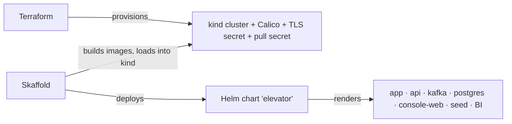

# Run on kind (Terraform · Helm · Skaffold)

The cluster path. Three tools, one job each — no overlap, no shell scripts.



| Tool | Owns | Replaces |
|------|------|----------|
| **Terraform** (`terraform/`) | kind cluster, Calico CNI, the api TLS keystore secret, the ghcr pull secret | `gen-tls.sh`, `kind-calico-up.sh`, `kind-calico.yaml` |
| **Helm** (`charts/elevator/`) | every k8s object + the `engine` / `bi.enabled` / `seed` toggles | the `k8s/*.yaml` pile, `bi.sh`, `configmap-switch-e2e.sh`, `seed-k8s.sh` |
| **Skaffold** (`skaffold.yaml`) | build the images → load into kind → deploy the chart → port-forward | `bi-up.sh`, `bi-down.sh`, the build/load/seed glue |

## Bring it up

```bash
# 1) provision the cluster once (creates kind + Calico + TLS + pull secret)
cd terraform && terraform init && terraform apply && cd ..

# 2) build + deploy the app (Skaffold loads images into kind, deploys the chart, seeds once)
skaffold run                 # one-shot   ·   or:  skaffold dev  (rebuild+redeploy on change)
```

`terraform apply` writes the CA the console CLI bundles, so run it **before** Skaffold builds.
`skaffold dev` port-forwards the api to `localhost:8080` — watch it with `elevator-console-cli monitor`.

## Toggles (no scripts)

```bash
skaffold run -p bi                              # Spark BI on (one batch driver → Parquet read-model)
skaffold run -p full                            # production shape: api:2, BI on (needs >1 node of CPU)
helm upgrade elevator charts/elevator --reuse-values --set config.engine=slow   # hot-swap the engine
helm upgrade elevator charts/elevator --reuse-values --set bi.enabled=false     # BI off (was bi.sh off)
```

## Tear down

```bash
cd terraform && terraform destroy      # deletes the whole kind cluster (and everything in it)
```

> Always tear down with `terraform destroy`, **never** `kind delete` — else Terraform's state drifts.

## Notes

- **Prereqs:** `terraform`, `helm`, `skaffold`, `kind`, `docker`, `kubectl`, `mvn`.
- The single-node kind box can't hold `api:2` + full Spark BI at once — the default `values-dev.yaml`
  trims to `api:1`, BI off. Use `-p full` only on a bigger node.
- The one non-declarative step left is a single `openssl` call in `terraform/tls.tf` — no provider
  emits a PKCS12 keystore, so Terraform builds it there and loads it into the secret.
- **CD** (`.github/workflows/cd.yml`) deploys this same chart with `helm upgrade` (images pinned to
  the commit). The old `k8s/*.yaml` is gone — the chart is the single source.
- **Local (non-cluster) alternative:** `docker compose -f docker-compose.demo.yml up` runs the whole
  backend in containers — see [run.md](run.md). `scripts/` now holds only the `pre-commit` hook.
