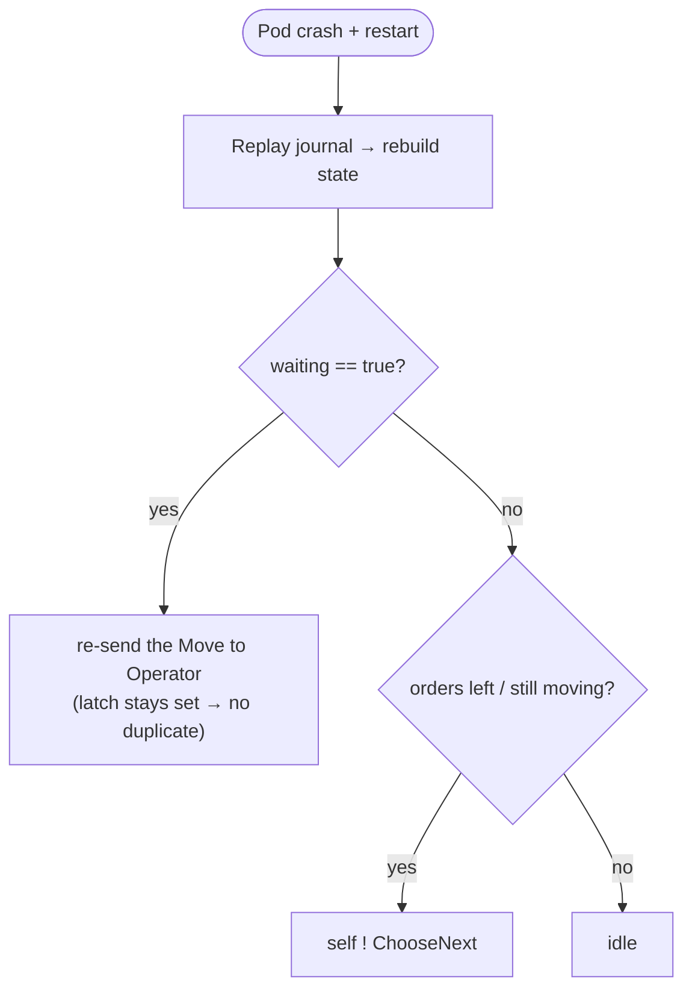

# Crash recovery

Event sourcing rebuilds actor state by replaying the journal. But two handoffs leave the
journal — to the stateless [Operator](actors.md), and to the dedup table — so each needs a
guard against a frozen car or a lost call.

## Controller — re-dispatch the in-flight move
`WaitingSet(true)` is durable, but the `Move` it waits on went to the stateless Operator.
A crash before the Operator reports back would replay `waiting=true` with the command gone —
a frozen car. On `RecoveryCompleted` the Controller re-sends the command; the latch is still
set, so no duplicate, and the Operator's report clears it. **This is the only move
redelivery — there is no wall-clock watchdog.**

## Ingress — claim *after* forwarding, never before
`CallConsumer` **checks** `processed_calls` up front to drop re-sent call ids, forwards the
call to the Coordinator, and only **then** marks the id processed — the Kafka offset commits
after that.

- **Claim first (wrong):** a crash between claim and offset-commit redelivers the message,
  but the already-claimed id is now dropped — accepted by nobody. Call lost.
- **Claim last (correct):** a crash there simply reprocesses the call. The up-front check
  normally drops the redelivery; even if one slips through, the exactly-once
  `CallStatusProjection` UPSERTs by call id, so `call_status` is unchanged.

> The Coordinator itself is **not** idempotent — it persists one `CallReceived` per call
> every time. Dedup lives at ingress and in the read-side UPSERT, not in the accept.
