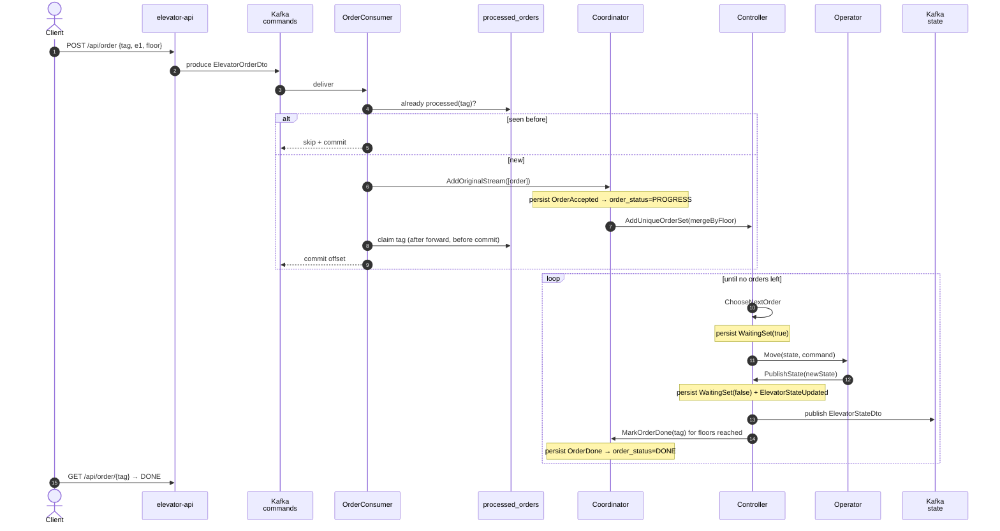

# Protocol

The exact messages each [actor](actors.md) speaks, and the order's end-to-end path.
**This is the source of truth for message names** — trust it over prose elsewhere.

## Message catalog

```scala
// Commands — in-memory, actor → actor
// CoordinatorProtocol
AddOriginalStream(orders: List[ElevatorOrderDto])   // raw orders from Kafka
MarkOrderDone(tag: String)                          // Controller: floor reached
// ControllerProtocol
AddUniqueOrderSet(orders: Set[ElevatorOrder])       // from Coordinator, merged by floor
ChooseNextOrder(orders: Set[ElevatorOrder])         // self-message: decide next move
PublishState(state: ElevatorState)                  // from Operator: move finished
// OperatorProtocol
Move(elevatorName, state: ElevatorState, command: ElevatorCommand)

// Events — persisted to the Postgres journal
// CoordinatorEvents
OrderAccepted(tag, elevatorName, floor);  OrderDone(tag)
// ControllerEvents
OrderAdded(order);  WaitingSet(waiting: Boolean);  ElevatorStateUpdated(state)

// Wire DTOs — JSON over Kafka
ElevatorOrderDto(tag, elevatorName, floor)                    // topic: elevator-commands
ElevatorStateDto(tag, elevatorName, direction, motion, floor) // topic: elevator-state
```

## End-to-end sequence



`served = orders where floor == newState.floor` — reaching a floor marks every order
waiting there done at once. Why claim-after-forward: [crash-recovery.md](crash-recovery.md).

## Two dedups — do not confuse them

| | Ingress dedup | Same-floor coalescing |
|---|---|---|
| Where | `OrderConsumer` + `processed_orders` table | `Controller` (`ControllerLogic.evolve`) |
| Keyed by | order **tag** | **floor** |
| Purpose | drop a Kafka message redelivered after a crash | one stop serves every order at that floor |

> `CoordinatorLogic.mergeByFloor` also coalesces by floor and is unit-tested, but on the
> live path it is a **no-op** — `OrderConsumer` sends one order per message. The coalescing
> that matters at runtime is the Controller's.

## Source map

| Thing | File |
|---|---|
| Actors | `elevator-app/.../actors/{Coordinator,Controller,Operator}.scala` |
| Commands | `elevator-common-protocol/.../{Coordinator,Controller,Operator}Protocol.scala` |
| Events | `elevator-common-events/.../{Coordinator,Controller}Events.scala` |
| Controller/Coordinator logic | `elevator-common-logic/.../{Controller,Coordinator}Logic.scala` |
| Scheduling | `elevator-common-strategy/.../NextFloorStrategy.scala` — see [scheduling.md](scheduling.md) |
| Ingress dedup | `elevator-app/.../inbound/{OrderConsumer,OrderDedup}.scala` |
| Projections | `elevator-app/.../readside/{ElevatorState,OrderStatus}Projection.scala` — see [read-model.md](read-model.md) |
