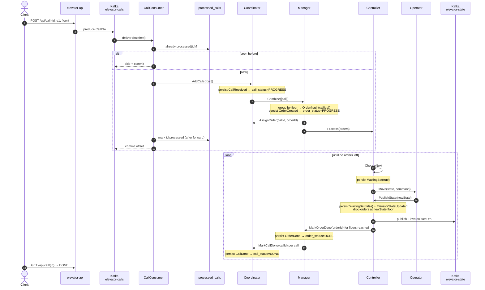

# Protocol

The exact messages each [actor](actors.md) speaks, and a call's end-to-end path.
**This is the source of truth for message names** — trust it over prose elsewhere.

## Message catalog

```scala
// Commands — in-memory, actor → actor
// CoordinatorProtocol
AddCalls(calls: List[CallDto])                 // from CallConsumer
AssignOrder(callId: String, orderId: String)  // from Manager: call belongs to this order
MarkCallDone(callId: String)                   // from Manager: call served
// ManagerProtocol
Combine(calls: List[Call])                      // from Coordinator: group into orders
MarkOrderDone(orderId: String)                  // from Controller: floor reached
// ControllerProtocol
Process(orders: Set[Order])                     // from Manager
ChooseNext(orders: Set[Order])                  // self-message: decide next move
PublishState(state: ElevatorState)              // from Operator: move finished
// OperatorProtocol
Move(elevatorName, state: ElevatorState, command: Command)

// Events — persisted to the Postgres journal
// CoordinatorEvents
CallReceived(callId, floor);  CallAssigned(callId, orderId);  CallDone(callId)
// ManagerEvents
OrderCreated(orderId, floor, callIds: Set[String]);  OrderDone(orderId)
// ControllerEvents
OrderAdded(order);  WaitingSet(waiting: Boolean);  ElevatorStateUpdated(state)

// Wire DTOs — JSON over Kafka
CallDto(id, elevatorName, floor)                              // topic: elevator-calls
ElevatorStateDto(elevatorName, direction, motion, floor)      // topic: elevator-state
OrderStateDto(orderId, elevatorName, floor, status, callIds)  // topic: elevator-order-state
CallStateDto(id, elevatorName, floor, status)                // topic: elevator-call-state
```

The three `*-state` topics feed the [BI](architecture.md) jobs.

## End-to-end sequence



`served = orders where floor == newState.floor` — reaching a floor serves every order
there at once. Why claim-after-forward: [crash-recovery.md](crash-recovery.md).

## Two dedups — do not confuse them

| | Ingress dedup | Same-floor grouping |
|---|---|---|
| Where | `CallConsumer` + `processed_calls` table | `Manager` (`GroupCallsStrategy`) |
| Keyed by | call **id** | **floor** |
| Purpose | drop a Kafka message redelivered after a crash | one order (stop) serves every call at that floor |

> A late call at an already-served floor gets a **new** order (its id is a fresh hash of a
> different call-id set) — orders are immutable snapshots.

## Source map

| Thing | File |
|---|---|
| Actors | `elevator-app/.../actors/{Coordinator,Manager,Controller,Operator}.scala` |
| Commands | `elevator-common-protocol/.../{Coordinator,Manager,Controller,Operator}Protocol.scala` |
| Events | `elevator-common-events/.../{Coordinator,Manager,Controller}Events.scala` |
| Logic | `elevator-common-logic/.../{Coordinator,Manager,Controller}Logic.scala` |
| Strategies | `elevator-common-strategy/.../{NextFloor,GroupCalls}Strategy.scala` — see [scheduling.md](scheduling.md) |
| Ingress dedup | `elevator-app/.../inbound/{CallConsumer,CallDedup}.scala` |
| Projections | `elevator-app/.../readside/{ElevatorStateProjection,OrderStatusProjection,CallStatusProjection}.scala` — see [read-model.md](read-model.md) |
