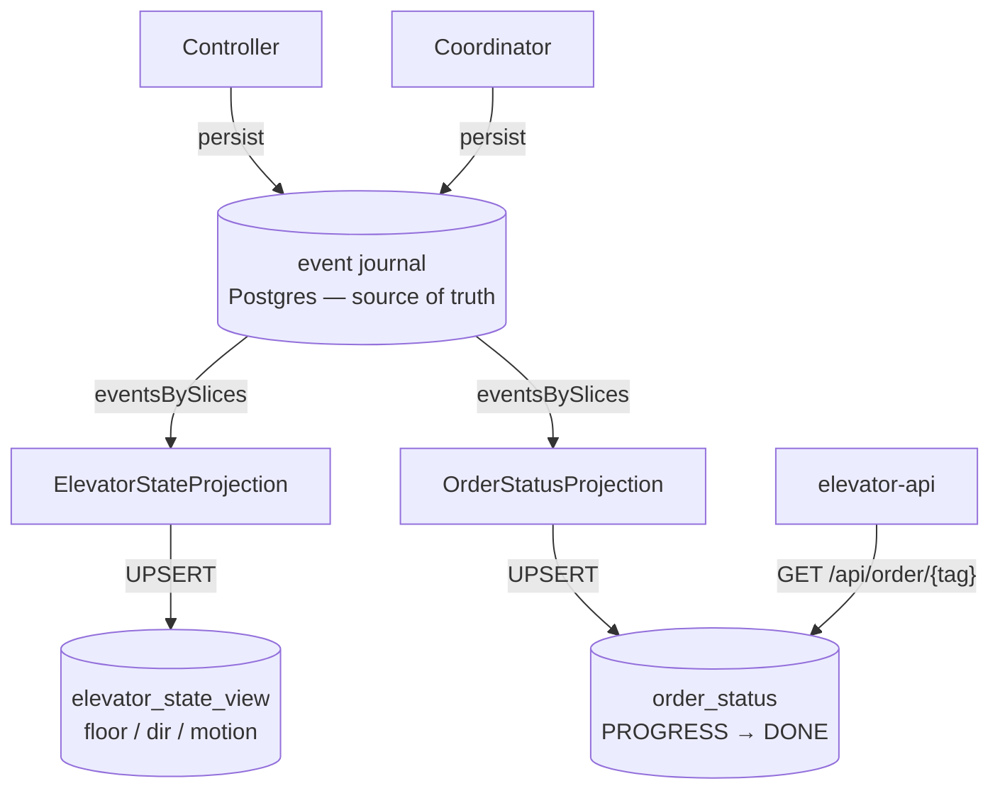

# Read model (CQRS)

The journal is the source of truth (write side). Two Pekko projections replay it into
queryable tables (read side). Kafka `elevator-state` stays as the **live, ephemeral** feed.

Both projections are role-gated to `read-model` nodes and run exactly-once.

## Which source to read?

| Need | Read from | Why |
|---|---|---|
| Live dashboard / console | Kafka `elevator-state` | push, sub-second; "now" only |
| Durable snapshot / after restart | `elevator_state_view` | correct right after restart, SQL-queryable |
| "Was order X done?" (by tag) | `order_status` via `GET /api/order/{tag}` | per-tag lifecycle, durable, indexed |

Best of both for a live UI: **seed** once from `elevator_state_view` (nothing blank at
startup), then **stream** live updates from Kafka.

> The api currently serves live `GET /api/elevator` from its in-memory Kafka-fed store, not
> from `elevator_state_view`. Pointing it at the durable view is the next step ([README roadmap](../README.md)).
