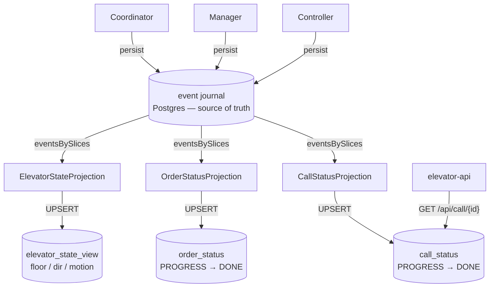

# Read model (CQRS)

The journal is the source of truth (write side). Three Pekko projections replay it into
queryable tables (read side). Kafka `elevator-state` stays as the **live, ephemeral** feed.

Each projection is role-gated to `read-model` nodes and runs exactly-once. Sources:
`ElevatorStateProjection` ← Controller events, `OrderStatusProjection` ← Manager events,
`CallStatusProjection` ← Coordinator events. A separate `processed_calls` table (not a
projection) is the ingress dedup — see [crash-recovery.md](crash-recovery.md).

## Which source to read?

| Need | Read from | Why |
|---|---|---|
| Live dashboard / console | Kafka `elevator-state` | push, sub-second; "now" only |
| Durable snapshot / after restart | `elevator_state_view` | correct right after restart, SQL-queryable |
| "Was call X done?" (by id) | `call_status` via `GET /api/call/{id}` | per-call lifecycle, durable, indexed |
| "Was order X done?" (by id) | `order_status` | per-order lifecycle (BI reads DONE counts) |

Best of both for a live UI: **seed** once from `elevator_state_view` (nothing blank at
startup), then **stream** live updates from Kafka.

> The api currently serves live `GET /api/elevator` from its in-memory Kafka-fed store, not
> from `elevator_state_view`. Pointing it at the durable view is the next step ([README roadmap](../README.md)).
