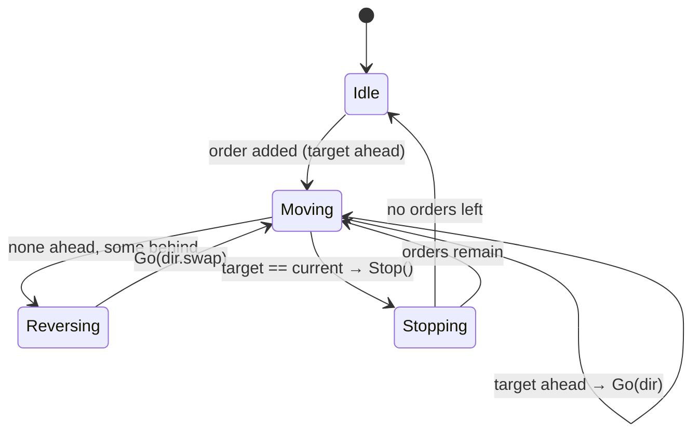

# Scheduling

How the [Controller](actors.md) picks the next move. Pure function
`NextFloorStrategy.default` — a simple **SCAN**: keep going the same way while a target is
ahead, else reverse, else stop.

```scala
if targets.contains(current) then Stop()               // arrived → stop, serve floor
else if targetAhead(current, dir, targets) then Go(dir)
else if targets.nonEmpty then Go(dir.swap)             // turn around
else Stop()                                            // nothing to do
```



Source: `elevator-common-strategy/.../NextFloorStrategy.scala`.
