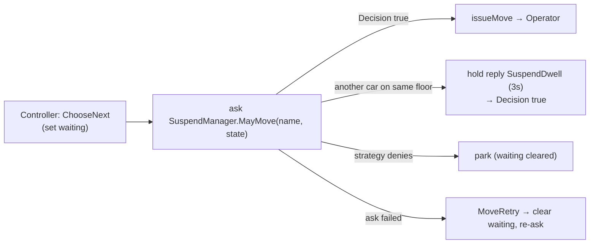

# Suspender

Every next move is gated. Before the [Controller](actors.md) issues a move it **asks** the
`SuspendManager` — a cluster **singleton** — whether the car may proceed. The answer comes back
as a command (you cannot block inside an event-sourced actor).

The singleton keeps two things: a `SuspendStrategy` (default **always allow** — a placeholder
policy hook) and a live map of **where each car is**. A car's floor is learned from every `MayMove`
and from an `Arrived` note the Controller sends on each arrival.

## Same-floor pause

When a car asks to move and **another car is on the same floor**, the singleton does **not** deny —
it **holds the reply** for `SuspendDwell.duration` (a fixed **3 s** domain value), then releases it
with `Decision(true)`. Both cars pause once, then both go — a soft stagger, no winner, no livelock.
The pause is just a *delayed answer*, so the Controller needs no retry logic.

- **Timeout above the dwell:** the Controller's ask timeout is `SuspendDwell.duration + 2 s`, so the
  delayed "go" always wins instead of falsely tripping `MoveRetry`.
- **Position freshness:** floors are known at ask-time and on arrival, so an idle car parked on a
  floor still counts; a car in transit keeps its last floor until it arrives.

## Invariants

- **Singleton, not per-car:** one owner of the global suspend state; Controllers on other pods ask
  it across the cluster (its `MayMove` / `Arrived` / `Decision` messages are serialized).
- **Fail open, don't strand:** a failed ask becomes `MoveRetry`, which releases the wait latch and
  re-enters the loop instead of freezing the car. A strategy deny parks.
- **Finish, then hold:** an in-flight move cannot be interrupted (the engine is a blocking sleep),
  so a paused car stops at the *next* floor, never between floors.

Source: `SuspendManager.scala`, `SuspendStrategy.scala`, `SuspendDwell.scala`, gated in
`Controller.scala` (`requestMove`). Recovery re-asks too — see [crash-recovery.md](crash-recovery.md).
