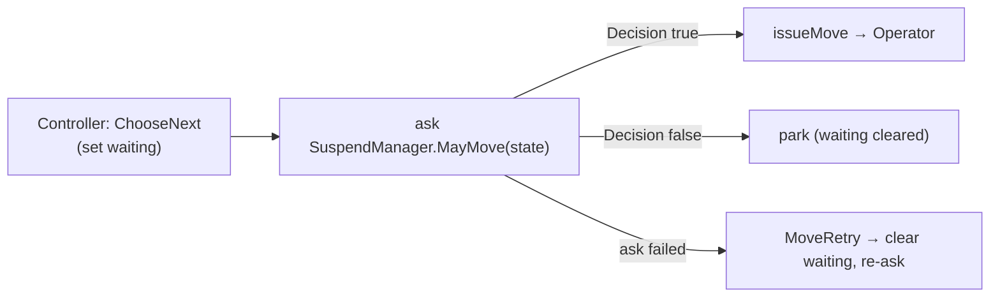

# Suspender

Every next move is gated. Before the [Controller](actors.md) issues a move it **asks** the
`SuspendManager` — a cluster **singleton** — whether the car may proceed. The answer comes back
as a command (you cannot block inside an event-sourced actor).

The decision is a pure `SuspendStrategy.mayMove(state)` held by the singleton. Default: **always
allow** — a placeholder, so behaviour is unchanged until a real policy lands (e.g. "send every car
to floor 0, then stop").

- **Singleton, not per-car:** one owner of the global suspend mode; Controllers on other pods ask
  it across the cluster (its `MayMove` / `Decision` messages are serialized).
- **Fail open, don't strand:** a failed ask becomes `MoveRetry`, which releases the wait latch and
  re-enters the loop (paced by the ask timeout) instead of freezing the car. A genuine deny parks.
- **Finish, then hold:** an in-flight move cannot be interrupted (the engine is a blocking sleep),
  so a suspended car stops at the *next* floor, never between floors.

Source: `SuspendManager.scala`, `SuspendStrategy.scala`, gated in `Controller.scala`
(`requestMove`). Recovery re-asks too — see [crash-recovery.md](crash-recovery.md).
