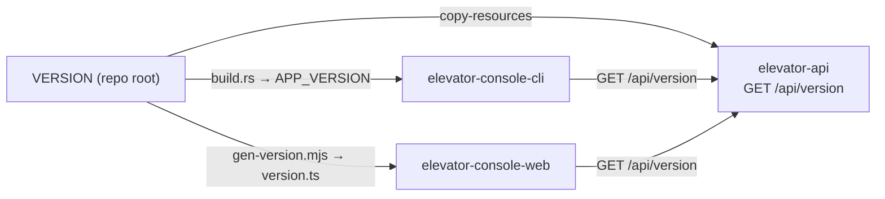

# Versioning

One version for the whole app, in one file: **`VERSION`** at the repo root (e.g. `1.0.0`).
Every component reads it at **build time**, so a single checkout always produces matching builds.

## Who reads VERSION, and how

| Component | Build wiring | Runtime |
|---|---|---|
| `elevator-api` | `maven-resources-plugin` copies `VERSION` onto the classpath (`elevator-api/pom.xml`) | `VersionController` serves `GET /api/version` → `{"version":"1.0.0"}` |
| `elevator-console-cli` | `build.rs` bakes it in as `env!("APP_VERSION")` | `--version`, and `version` subcommand |
| `elevator-console-web` | `scripts/gen-version.mjs` writes `src/app/version.ts` (pre-build / post-install) | `APP_VERSION` constant, shown in the top bar |

## The compatibility check

Each console is the **frontend**: it knows its own baked-in version and asks the backend for its
version, then compares.

- **Rust CLI:** `elevator-console-cli version` prints both and exits non-zero on a mismatch.
- **Web:** the top bar shows `v<web> = api <backend>`; on a mismatch a red warning bar appears.

## Releasing a new version

1. Edit `VERSION` (one line, e.g. `1.1.0`).
2. Rebuild — `./mvnw -Pconsole install` picks it up everywhere (the Rust `build.rs` and the Angular
   pre-build hook both `rerun`/regenerate on the new value).

`VERSION` is the only place to change. Maven `<version>` in the poms stays independent and is **not**
the app version (keeps the "never edit pom version" rule intact).
