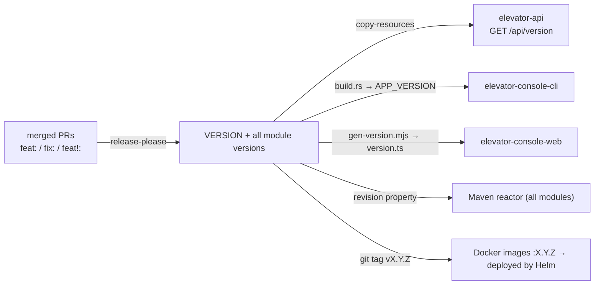

# Versioning

One version for the whole app, in one file: **`VERSION`** at the repo root (e.g. `1.0.0`).
Every component reads it at **build time**, so a single checkout always produces matching builds.
You never edit a version by hand — **release-please** bumps it from your commit messages.

## Who reads VERSION, and how

| Component | Build wiring | Runtime |
|---|---|---|
| `elevator-api` | `maven-resources-plugin` copies `VERSION` onto the classpath | `VersionController` serves `GET /api/version` |
| `elevator-console-cli` | `build.rs` bakes it in as `env!("APP_VERSION")` | `--version`, `version` subcommand |
| `elevator-console-web` | `scripts/gen-version.mjs` writes `src/app/version.ts` | `APP_VERSION`, shown in the top bar |
| Maven reactor | `<revision>` property in the root `pom.xml`; every module is `${revision}` | jar/image names are `…-X.Y.Z` |
| Docker images | tagged with the git tag `X.Y.Z` on release (`cd.yml`) | `helm upgrade --set global.images.*=…:X.Y.Z` pins the deploy |

> **Helm chart version is independent.** `Chart.yaml` `version` / `appVersion` are packaging
> metadata and are **not** in lockstep — release-please can't edit a `.yaml` without reformatting it
> (it strips comments and mishandles the subchart pins). What actually runs is decided by the
> **image tag** (git tag), which release-please drives. So the chart version stays put; the app
> version travels with the images.

## How the version is chosen — automatically

Commits follow **Conventional Commits**. Because the repo squash-merges, the **PR title** is the
commit release-please reads (a CI check enforces the format):

| PR title | version effect (pre-1.0) |
|---|---|
| `fix: …` | patch — `0.0.1 → 0.0.2` |
| `feat: …` | minor — `0.0.1 → 0.1.0` |
| `feat!: …` or `BREAKING CHANGE:` | minor while < 1.0.0 (`bump-minor-pre-major`) |
| `chore: … / docs: … / refactor: …` | no release on their own |

## Releasing

You do **not** touch version numbers. The flow is:

1. Merge normal PRs to `main` (conventional titles).
2. release-please keeps a **release PR** open ("chore: release X.Y.Z") that bumps `VERSION` +
   every module version + the changelog. Review it like any PR.
3. **Merge the release PR** → release-please tags `vX.Y.Z` and creates the GitHub Release →
   `cd.yml` publishes images `ghcr.io/…:X.Y.Z` and deploys the chart pinned to that version.

Config: `release-please-config.json` + `.release-please-manifest.json`. Version-bearing lines carry
an `x-release-please-version` marker so release-please updates them in place (pom `<revision>`,
`elevator-bi` pom, `Cargo.toml`); `package.json` is updated by jsonpath (no marker possible in JSON).
The Helm charts are deliberately left out (see the note above).

## Enforced rules

- **Lockstep** — `ci.yml` fails the build if any module version ≠ `VERSION`.
- **Conventional PR titles** — `pr-title.yml` (the release depends on them).
- **Tag == VERSION** — `cd.yml` refuses to publish a tag that doesn't match `VERSION`.
- **Immutable releases** — a published `:X.Y.Z` image is never overwritten; `:latest` tracks the
  newest release only.

## One-time setup

Add a repo secret **`RELEASE_PLEASE_TOKEN`** (a PAT with `repo` + `workflow` scope, or a
fine-grained token with contents + pull-requests write). It lets the tag release-please pushes
trigger `cd.yml`. Without it the release is still created, but you start the deploy manually
(`cd.yml` → *Run workflow* on the tag).
