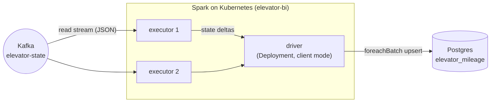

# elevator-bi — Spark BI jobs

Spark BI jobs over the elevator system, each upserting a Postgres read-model for reporting:

| Job | Kind | What | Source → sink |
|---|---|---|---|
| **MileageJob** | Structured Streaming | each elevator's **mileage** = floors travelled (`Σ \|floor − prevFloor\|`) | `elevator-state` Kafka → `elevator_mileage` |
| **OrdersServedJob** | Batch (interval loop) | how many times each elevator **reached an ordered floor** (= completed orders) | `order_status` (JDBC) → `elevator_orders_served` |

> Why OrdersServedJob reads a table, not Kafka: the `elevator-state` topic publishes an **empty tag**
> (`ElevatorStateDto("", …)` in `Controller.scala`), so it carries no order info. The completion
> signal lives in the `order_status` read-model (`status='DONE'`), so the job counts DONE rows there.



## Why standalone + Scala 2.12

Spark has **no Scala 3 build** ([SPARK-54150](https://issues.apache.org/jira/browse/SPARK-54150) is
open, no release), and the official Spark images are published for **Scala 2.12 only**. So this is a
**standalone** Maven module (its own pom, NOT in the root reactor) pinned to Scala 2.12. It does not
depend on the Scala 3 `elevator-common`; it reads `elevator-state` by its JSON wire schema, which
keeps the analytics job decoupled from the producer's internal types anyway.

## Layout

| File | Role |
|---|---|
| `Mileage.scala` | Pure fold `Option[MileageState] × Seq[Int] → Option[MileageState]` (unit-tested, no Spark) |
| `kafka/ElevatorStateSchema.scala` | Explicit `StructType` for the `elevator-state` JSON |
| `config/BiConfig.scala` | Env-driven configuration (12-factor) |
| `sink/PostgresMileageSink.scala` | Idempotent JDBC upsert (`CREATE TABLE IF NOT EXISTS` + `ON CONFLICT`) |
| `MileageJob.scala` | The streaming job: Kafka → `flatMapGroupsWithState` per elevator → `foreachBatch` |
| `OrdersServed.scala` | Pure Spark transform: `order_status` DataFrame → per-elevator DONE counts (unit-tested with a local `SparkSession`) |
| `sink/PostgresOrdersServedSink.scala` | Idempotent JDBC upsert of the served counts |
| `OrdersServedJob.scala` | The batch job: JDBC read `order_status` → `tally` → upsert, on a fixed interval loop |

## Build & test

```bash
mvn -f elevator-bi/pom.xml package      # compiles (Scala 2.12) + runs ScalaTest + builds the uber jar
```

The uber jar bundles the Kafka source + Postgres driver; Spark itself is `provided` by the runtime image.

## Deploy (full Spark-on-Kubernetes, no operator/Helm)

```bash
scripts/bi-up.sh          # build jar + image, kind-load, apply manifests, wait for driver + executors
scripts/bi-logs.sh        # collect driver + executor logs into logs/bi/
scripts/bi-down.sh        # tear down (add --purge to also drop the table)
```

- The `elevator-mileage` **Deployment** runs the Spark **driver** in *client mode*; it spawns 2
  **executor pods** via the Kubernetes resource manager. The Deployment restarts the driver if it dies.
- **Checkpoint** (stateful streaming state) lives on a `hostPath` shared by driver + executors —
  correct because kind is a **single node**. On a multi-node cluster, point
  `ELEVATOR_BI_CHECKPOINT` / `spark.eventLog.dir` at **S3 (`s3a://`)** or **NFS** instead.

## Logs

Stored three ways (see `conf/log4j2.properties` + `k8s/bi/mileage-driver.yaml`):
1. **stdout** — `kubectl logs` / the driver Deployment.
2. **durable rolling files** — one per pod on the persistent `/opt/elevator-bi/logs` hostPath volume.
3. **Spark event logs** — `file:///checkpoint/spark-events` (job/stage history, History-Server-readable).

`scripts/bi-logs.sh` pulls all three into `logs/bi/`.

## Query via the API

The elevator-api exposes the `elevator_mileage` read-model (Java/WebFlux, R2DBC — same pattern as
`order_status`):

| Endpoint | Returns |
|---|---|
| `GET /api/mileage` | every elevator's mileage, sorted by floors travelled (desc) |
| `GET /api/mileage/{name}` | one elevator's mileage (404 if unknown) |

```json
GET /api/mileage
[ { "elevatorName": "e4", "floorsTravelled": 65, "updatedAt": "2026-07-06T11:18:02.206Z" }, ... ]
```

## Config (env)

| Var | Default | Meaning |
|---|---|---|
| `ELEVATOR_KAFKA_BOOTSTRAP_SERVERS` | `kafka:9092` | Kafka brokers |
| `ELEVATOR_KAFKA_STATE_TOPIC` | `elevator-state` | source topic |
| `ELEVATOR_BI_STARTING_OFFSETS` | `earliest` | first-run offset (checkpoint takes over after) |
| `ELEVATOR_BI_CHECKPOINT` | `file:///checkpoint` | streaming checkpoint dir (shared FS) |
| `ELEVATOR_BI_TRIGGER` | `10 seconds` | micro-batch interval |
| `ELEVATOR_BI_JDBC_URL` | `jdbc:postgresql://postgres:5432/elevator` | sink DB |
| `ELEVATOR_PG_USER` / `ELEVATOR_PG_PASSWORD` | `elevator` / `elevator` | sink creds (demo — use a Secret in prod) |
| `ELEVATOR_BI_TABLE` | `elevator_mileage` | sink table |
