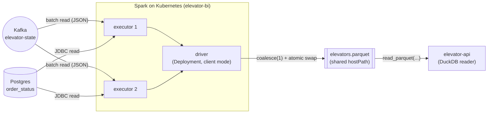

# elevator-bi — Spark BI job

One Spark **batch** job that builds a single per-elevator read-model and writes it as **one Parquet
file** (no analytics database). The api reads that file directly via **DuckDB**.

| Metric | What | Source |
|---|---|---|
| **floorsTravelled** (mileage) | `Σ \|floor − prevFloor\|` over the elevator's state history | `elevator-state` Kafka (batch read) |
| **ordersServed** | how many times it **reached an ordered floor** (= completed orders) | `order_status` (JDBC), `status='DONE'` |

Each cycle the job re-scans both sources, joins them into **one row per elevator**
(`elevatorName, floorsTravelled, ordersServed`), and **overwrites** `elevators.parquet`. The fleet is
tiny, so a full re-scan every interval is cheap and needs no streaming checkpoint.

> Why orders-served reads a table, not Kafka: the `elevator-state` topic publishes an **empty tag**
> (`ElevatorStateDto("", …)` in `Controller.scala`), so it carries no order info. The completion
> signal lives in the `order_status` read-model (`status='DONE'`).

> Why Parquet is overwritten, not appended: Parquet files are **immutable** (no row-level upsert), so
> "one current row per elevator" means rewriting the whole snapshot. `ParquetSink` writes to a
> `.staging` dir then swaps it onto the target with a single move, so readers never see a half-written
> file.



## Why standalone + Scala 2.12

Spark has **no Scala 3 build** ([SPARK-54150](https://issues.apache.org/jira/browse/SPARK-54150) is
open, no release), and the official Spark images are published for **Scala 2.12 only**. So this is a
**standalone** Maven module (its own pom, NOT in the root reactor) pinned to Scala 2.12. It does not
depend on the Scala 3 `elevator-common`; it reads `elevator-state` by its JSON wire schema.

## Layout

| File | Role |
|---|---|
| `Mileage.scala` | Pure fold `Option[MileageState] × Seq[Int] → Option[MileageState]` (unit-tested, no Spark) |
| `OrdersServed.scala` | Pure Spark transform: `order_status` DataFrame → per-elevator DONE counts |
| `ElevatorStats.scala` | Spark transforms: batch mileage per elevator + the join into one row per elevator |
| `kafka/ElevatorStateSchema.scala` | Explicit `StructType` for the `elevator-state` JSON |
| `config/BiConfig.scala` | Env-driven configuration (12-factor) |
| `sink/ParquetSink.scala` | `coalesce(1)` overwrite to Parquet via a staging dir + atomic swap |
| `ElevatorStatsJob.scala` | The batch loop: read Kafka + `order_status` → join → write Parquet, on a fixed interval |

## Build & test

```bash
mvn -f elevator-bi/pom.xml package      # compiles (Scala 2.12) + runs ScalaTest + builds the uber jar
```

The uber jar bundles the Kafka source + Postgres driver; Spark itself is `provided` by the runtime image.

## Deploy (full Spark-on-Kubernetes, via the Helm chart)

The BI layer is part of the `elevator` Helm chart, gated by `bi.enabled` (see [docs/cluster.md](../docs/cluster.md)):

```bash
skaffold run -p bi        # build jar + image, load into kind, deploy the stats driver
kubectl logs deploy/elevator-stats -f            # driver logs (executors: kubectl logs -l role=executor)
helm upgrade elevator charts/elevator --reuse-values --set bi.enabled=false   # tear the BI layer down
```

- The `elevator-stats` **Deployment** runs the Spark **driver** in *client mode*; it spawns 2
  **executor pods**. The Deployment restarts the driver if it dies.
- The **Parquet** file lives on a `hostPath` shared by driver + executors + the api — correct because
  kind is a **single node**. On a multi-node cluster, point `ELEVATOR_BI_PARQUET_PATH` at **S3
  (`s3a://`)** or **NFS** instead.

## Config (env)

| Var | Default | Meaning |
|---|---|---|
| `ELEVATOR_KAFKA_BOOTSTRAP_SERVERS` | `kafka:9092` | Kafka brokers |
| `ELEVATOR_KAFKA_STATE_TOPIC` | `elevator-state` | source topic (mileage) |
| `ELEVATOR_BI_SOURCE_JDBC_URL` | `jdbc:postgresql://postgres:5432/elevator` | operational DB (orders served) |
| `ELEVATOR_BI_ORDER_STATUS_TABLE` | `order_status` | source table for DONE counts |
| `ELEVATOR_PG_USER` / `ELEVATOR_PG_PASSWORD` | `elevator` / `elevator` | DB creds (demo — use a Secret in prod) |
| `ELEVATOR_BI_PARQUET_PATH` | `file:///data/elevators.parquet` | output Parquet (shared volume) |
| `ELEVATOR_BI_INTERVAL` | `30` | refresh interval (seconds) |
